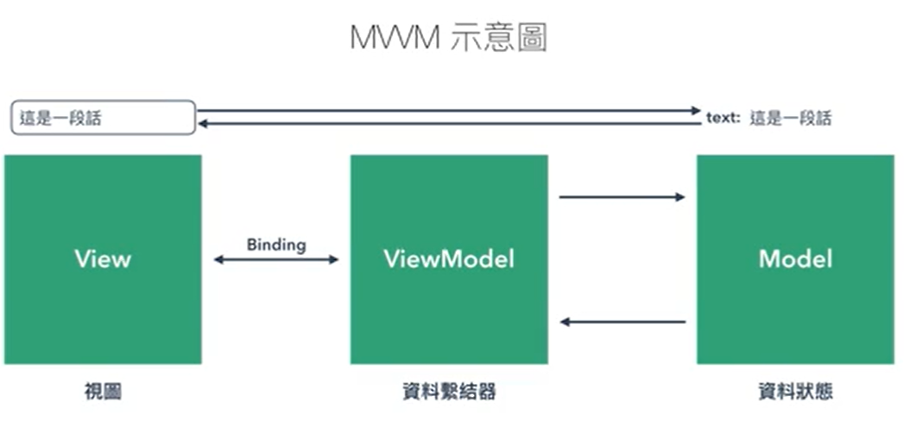

# 壹、目錄及代辦事項
## Table of Contents
+ 壹、目錄及代辦事項
    + Table of Contents
    + 待學習項目
+ 貳、基礎內容文件要點說明
    + 一、Vue 開發環境介紹
    + 二、建立應用程式
    + 三、雙向綁定的資料
    + 四、MVVM 的概念
    + 五、v-bind 動態屬性指令
        1. 透過 v-bind 添加 html 屬性，類似 setAttribute。但是這樣說可能會有點差距，因為 vue 裡面是使用property 來綁定 HTML 屬性，而不是 attribute。
        2. v-bind 內可以放入表達式
    + 六、v-for 、 v-if
        1. v-for:
        2. v-if:
        3. 避免將 v-for 、 v-if 放在同一層內。
    + 七、使用 v-on 來操作頁面行為
        1. 按下按鈕後，觸發文字反轉的行為並顯示文字
        2. 可以把函式內容寫在 v-on 裡面
        3. v-on 帶入參數
    + 八、透過修飾符，讓 v-on 操作更簡單
        1. v-on:click後面的修飾符
        2. 鍵盤修飾符
        3. 滑鼠修飾符
        4. 縮寫
    + 九、 v-class 動態切換 className
        + 動態增加class
    + 十、computed 運算功能
        1. computed 內必須是 function
        2. 一定要回傳值 return
        3. 如果不是在 this 內，computed無法被觸發
        4. computed 不能傳參數 function( para )
        5. computed 變更條件是資料更動時
    + 十一、Methods 與 Computed 的使用情境
        1. computed 是在監控資料更動後，重新運算結果呈現於畫面上
        2. methods 就是互動的函式，需要觸發才會運作
        3. 效能
    + 十二、Vue 表單與資料的綁定
        1. checkbox、radio、selected 的 v-model 會去綁定 value 內的值
        2. 在input內type="checkbox"的v-model
        3. select 結合 v-for
        4. 複選框
        5. 修飾符介紹
    + 十三、元件基礎概念
        1. vue 的 conponent 中，每個元件都可以獨立的儲存自己的狀態
        2. 元件必須先定義，後面的程式碼才讀取的到，所以要擺在前面。
        3. 試著定義一個元件
+ 貳、 製作一個 Todo List 來小試身手吧
    + 參考 Medium 文章
+ 參、進階模板語法介紹
    + 一、模板資料細節說明
        1. v-model=“text”
        2. v-text=“text”、{{ text }} 與 v-once
        3. v-html
        4. 表達式 {{ }}
        5. 改變 input 的屬性
    + 二、 動態切換 ClassName 及 Style 多種方法
        1. 物件寫法
        2. 物件寫法2
        3. 陣列寫法
        4. 綁定行內樣式
        5. Vue 會為不同瀏覽器加上 Prefix
    + 三、v-for 與其使用細節
        1. index (索引) 可以不只是數字，當物件有鍵值時就會把數字替換成鍵值
        2. 避免 DOM 元素快速置換的方法
        3. 使用 v-for 過濾陣列
        4. v-for 無法運行的狀況
    + 四、 v-if 、v-else 與 v-else-if
        1. v-if 、v-else 的運用
        2. template 標籤
        3. v-else-if 的運用
        4. v-if 與 v-show 的差異
        5. key
    + 五、 Computed 與 Watch
        1. computed
        2. 使用 Computed 來呈現時間格式
        3. Watch
+ 肆、Vue的生命週期
+ 伍、Vue.js 元件
    + 一、使用 x-template 建立元件
        1. 建立全域的元件
        2. 建立區域的元件
        3. 使用 function return 建構資料格式
        4. props 基本觀念
        5. props 使用上的注意事項
        6. props 型別及預設值
        7. emit 向外層傳遞事件
        8. 元件插槽
        9. 使用 is 動態切換元件
+ 陸、Vue 常用 API
    + 一、使用 Extend 避免重複造輪子
    + 二、Filter 自訂畫面資料呈現格式
        1. 區域使用方法
        2. 全域使用方法
        3. filter 使用範例
    + 三. 無法寫入的資料，用 set 搞定他
        1. 有時使用 AJAX 時，無法先定義 data 內的資料內容，可以用 set 來強制寫入
        2. Vue.set (target, propertyName/index, value)
        3. 補充資料1、補充資料2
    + 四、 Mixin 混合其它的元件內容
        1. 使用 mixin 做出一個可以讓其他元件複製的內容。
    + 五、使用 Directive 開發自己的互動 UI
        1. 官方文件的例子:
        2. Directive 的生命週期
        3. 使用 directive 做表單驗證
        4. directive 詳細用法
    + 六、插入外部套件
+ 柒、Vue Cli 的建置與運作原理
    + 一、安裝 Vue cli
        1. 將 Vue-cli 安裝在全域的環境下
        2. 查看 Vue 指令
        3. list 列出官方可以用的樣板
        4. 開啟一個 webpack 樣板
        5. 安裝相關套件
        6. 執行專案
    + 二、新增自定義環境變數
    + 三、 安裝套件在 Vue Webpack 中
        1. 安裝 bootstrap 及 sass
        2. vue-cli 資料夾說明
        3. 使用 vue-axios 套件串接 AJAX
+ 捌、Vue Router
    + 一、使用 Vue Router 及配置路由文件
    + 二、新增路由路徑及連結
    + 三、 製作巢狀路由頁面
    + 四、 使用動態路由切換頁面 Ajax 結果
    + 五、 命名路由，同一個路徑載入兩個頁面元件
    + 六、 Vue Router 參數設定
    + 七、 自定義切換路由方法
+ 玖、 Vue 出一個電商網站
    + 一、登入介面
    + 二、驗證登入及 Vue Router 的配置
        1. 在 main.js 下使用 router.beforeEach 來設定導航守衛
    + 三、 套用 Bootstrap Dashboard 版型
        1. 建立 Dashboard 版型
    + 四、製作產品列表
    + 五、 Vue 中運用 Bootstrap 及 jQuery
    + 六、 產品的新增修改
        1. methods 內新增更新資料的函數
        2. 舊資料中編輯資料與新建立產品共用函式
        3. 刪除產品
    + 七、串接上傳檔案 API
    + 八、增加使用者體驗 - 讀取中效果製作
    + 九、 產品列表的分頁邏輯
        1. 使用後端的傳來的資料製作分頁功能
    + 十、套用價格的 Filter 技巧
        1. 在 src 的資料下再建立一個 filter 的資料夾
        2. 將千分位的公式放在這的資料夾下
        3. 在 main.js entry 下，import fliter 的資料進來
    + 十一、Dashboard 新增模擬購物頁面 - 新增卡片式產品列表
    + 十二、取得單一產品
    + 十三、
    + 十四、刪除購物車品項及新增優惠碼
    + 十四、建立訂單及表單驗證技巧
        1. 安裝 VeeValidate 套件
        2. 使用 VeeValidate
    + 十五、 Vue-CLI 3
        1. Vue CLI 2 和 3 的差別
        2. 安裝
        3. 環境變數的設定
        4. 使用 Vue GUI
    + 十六、Vuex 管理大型網站資料狀態
        1. Vuex 的組成
        2. 新增一個 Store
        3. 正確的使用 action 和 mutation 來取得變數
        4. 使用 Actions 取得遠端資料
        5. payload 傳遞物件參數
        6. Vuex 中的 Getters 及 mapGetters, mapActions
        7. 模組化資料運用

## 待學習項目
    -
    -
    -
    -

# 貳、基礎內容文件要點說明
## 一、Vue 開發環境介紹
Vue 是由資料來驅動畫面的，因此資料是不斷在變動的。

這邊就要用 Vue Dev tools 來檢視資料。

## 二、建立應用程式
+ 使用el綁定ID
    + 直接使用 el:"#app" 掛載
    + 在需要時再使用 $mount("#app") 掛載的功能
+ Vue的應用程式不能巢狀排列
```html
<div id="app">
  {{ text }}
</div>

<script>
var app = new Vue({
  el: '#app',
  data: {
    text: '這是一段話'
  }
});
</script>
```
+ 呈現程式碼在頁面的方法 < pre >< /pre >
```html
<div id="app">
  <pre>{{ list }}</pre>
</div>

<script>
var app = new Vue({
  el: '#app',
  data: {
    list: [
      {
        name: '小明',
        age: 16
      },
      {
        name: '媽媽',
        age: 38,
      },
      {
        name: '漂亮阿姨',
        age: 24
      }
    ]
  }
})
</script>
```

## 三、雙向綁定的資料
1. v-model : 透過花括號{{}}方式綁定文字，基本上 v-model 只會用在 input, textarea, select 這些傳入資訊的元素
2. v-text : 透過指令的方式增加文字
3. v-html : 透過指令的方式增加文字及Html標籤
```html
<div id="app">
  {{message}}
  <div v-text="text1"></div>
  <div V-html="text2"></div>
  <input type="text" v-model="message">
</div>

<script>
var app = new Vue({
  el: '#app',
  // 在此建立資料內容

  data: {
    message: '哈囉',
    text1: 'v-text',
    text2: '<h1>html-text</h1>',
  }
})
</script>
```

## 四、MVVM 的概念
VueJS是以資料狀態操作畫面


## 五、v-bind 動態屬性指令
### 1. 透過 v-bind 添加 html 屬性，類似 setAttribute。但是這樣說可能會有點差距，因為 vue 裡面是使用property 來綁定 HTML 屬性，而不是 attribute。
```html
<div id="app">
  
</div>


<script>
var app = new Vue({
  el: '#app',
  data: {
  //加上IMG連結
    imgSrc: 'https://images.unsplash.com/photo-1479568933336-ea01829af8de?ixlib=rb-0.3.5&ixid=eyJhcHBfaWQiOjEyMDd9&s=d9926ef56492b20aea8508ed32ec6030&auto=format&fit=crop&w=2250&q=80',
    className: 'img-fluid', //加上class
  }
})
</script>
```
### 2. v-bind 內可以放入表達式
表達式：()有值的
```html
<input type="check" v-bind:check = "count%2===0">
// (count%2===0) 值為 true or false
// count 為偶數時才打勾
```
## 六、v-for 、 v-if
### 1. v-for:
動態產生多筆資料於畫面上

當括號中有不同筆數的資料，變數也代表不同意思
```
v-for="(itemValue,item,index) in array"
v-for="(item,index) in array"
v-for="item in array"
```
+ itemValue : 回傳的是陣列中的屬性值。冒號:後
+ item : 回傳的是陣列中的屬性名稱。冒號:前
+ index : 回傳的是陣列中的索引值

### 2. v-if:
過濾資料條件

### 避免將 v-for 、 v-if 放在同一層內。
```html
<div id="app">
  <ul class="mb-0">
    //v-for 內宣告有什麼會用在 list 內， v-if 過濾顯示的條件
    <li v-for="(item, index) in list" >
        <span v-if="item.age>25">{{ index+1 }} - {{ item.name }} 今年 {{ item.age }}歲....</span>    
    </li>
  </ul>
</div>

<script>
var app = new Vue({
  el: '#app',
  data: {
    list: [
      {
        name: '小明',
        age: 16
      },
      {
        name: '媽媽',
        age: 38,
      },
      {
        name: '漂亮阿姨',
        age: 24
      }
    ]
  }
})
</script>
// result : 2 - 媽媽今年38歲....
```

## 七、使用 v-on 來操作頁面行為
### 1. 按下按鈕後，觸發文字反轉的行為並顯示文字
+ 使用this來選取這個app裡面的屬性
+ v-on:click搭配methods內的函式來觸發動作
+ 可以觸發多個函式 v-on:click="firstFunction(); secondFunction();
+ v-on要使用的資料一定要在data中預先定義好
```html
<div id="app">
  <input type="text" class="form-control" v-model="text">
  <button class="btn btn-primary mt-1" v-on:click = "reverseText">反轉字串</button>
  <div class="mt-3">
    {{ newText }}
  </div>
</div>

<script>
var app = new Vue({
  el: '#app',
  data: {
    text: '',
    newText: ''
  },
  methods: {
    reverseText : function() {
      this.newText = this.text.split('').reverse().join('');//split('')先轉為陣列，reverse()反轉陣列，join('')重組回字串
    }
  },
});
</script>
```

### 2. 可以把函式內容寫在 v-on 裡面
```html
<p>請切換下方 box 的 className</p>
  <div class="box" :class="{'rotate': isRotate }"></div>
  <hr>
  //將 v-on 觸發後的動作寫在 @click 裡面
  <button class="btn btn-outline-primary" @click="isRotate= !isRotate">切換 box 樣式</button>
  
  //呼叫函式執行動作
  <button class="btn btn-outline-primary" @click="changeRotate">切換 box 樣式</button>
  
data: {
    isRotate: false,
  },
  methods: {
    changeRotate: function() {
      this.isRotate = !this.isRotate;
    },
  }
});
```

### 3. v-on 帶入參數
每按一次按鈕，item.cash 的錢就會加五百
```html
<h4>帶入參數</h4>
<ul>
    <li v-for="item in arrayData" class="my-2">
      {{ item.name }} 有 {{ item.cash }} 元 
      <button class="btn btn-sm btn-outline-primary" @click="storeMoney(item)">儲值</button>
    </li>
</ul>
  
methods: {
    storeMoney: function(item) {
      item.cash = item.cash + 500;
    },
  }
```

## 八、透過修飾符，讓 v-on 操作更簡單
### 1. v-on:click後面的修飾符
+ .stop 停止 event.stopPropagation()。停止冒泡事件，由內而外 button -> box -> div
+ .prevent 停止預設動作
+ .capture 添加事件偵聽器時使用 capture 模式。 由外而內 div -> box -> button
+ .self 只觸發本身事件
+ .once 只觸發一次事件
+ .passive
```html
<!-- 阻止单击事件继续传播 -->
<a v-on:click.stop="doThis"></a>

<!-- 提交事件不再重载页面 -->
<form v-on:submit.prevent="onSubmit"></form>

<!-- 修饰符可以串联 -->
<a v-on:click.stop.prevent="doThat"></a>

<!-- 只有修饰符 -->
<form v-on:submit.prevent></form>

<!-- 添加事件监听器时使用事件捕获模式 -->
<!-- 即内部元素触发的事件先在此处理，然后才交由内部元素进行处理 -->
<div v-on:click.capture="doThis">...</div>

<!-- 只当在 event.target 是当前元素自身时触发处理函数 -->
<!-- 即事件不是从内部元素触发的 -->
<div v-on:click.self="doThat">...</div>
```
### 2. 鍵盤修飾符
+ .enter
+ .tab
+ .delete (捕获“删除”和“退格”键)
+ .esc
+ .space
+ .up
+ .down
+ .left
+ .right
```html
<h5>按鍵修飾符</h5>
  <ul>
    <li>.{keyCode | keyAlias} - 只當事件是從特定鍵觸發時才觸發回調。</li>
    <li>別名修飾 - .enter, .tab, .delete, .esc, .space, .up, .down, .left, .right</li>
    <li>修飾符來實現僅在按下相應按鍵時才觸發鼠標或鍵盤事件的監聽器 - .ctrl, .alt, .shift, .meta</li>
  </ul>
  <h6 class="mt-3">keyCode</h6>
  <input type="text" class="form-control" v-model="text" @keyup.13="trigger(13)">

  <h6 class="mt-3">別名修飾</h6>
  <input type="text" class="form-control" v-model="text" @keyup.space="trigger('space')">

  <h6 class="mt-3">相應按鍵時才觸發的監聽器</h6>
  <input type="text" class="form-control" v-model="text" @keyup.shift.enter="trigger('shift + Enter')">
```

### 3. 滑鼠修飾符
```html
<h5>滑鼠修飾符</h5>
  <ul>
    <li>.left - (2.2.0) 只當點擊鼠標左鍵時觸發。</li>
    <li>.right - (2.2.0) 只當點擊鼠標右鍵時觸發。</li>
    <li>.middle - (2.2.0) 只當點擊鼠標中鍵時觸發。</li>
  </ul>
  <h6 class="mt-3">滑鼠修飾符</h6>
  <div class="p-3 bg-primary">
    <span class="box" @click.middle="trigger('Right button')">
    </span>
  </div>
```

### 4. 縮寫
+ v-on的縮寫 @
+ v-bind的縮寫 :
```html
<div id="app">
  <input type="text" class="form-control" v-model="text" @keyup.enter="reverseText">
  <a :href="src" class="btn btn-primary mt-1" @click.prevent="reverseText">反轉字串</a>
  <div class="mt-3">
    {{ newText }}
  </div>
</div>

<script>
var app = new Vue({
  el: '#app',
  data: {
    text: '',
    newText: '',
    src:'https://www.google.com/'
  },
  // 請在此撰寫 JavaScript
  methods: {
    reverseText(event) {
      this.newText = this.text.split('').reverse().join('');
    }
  }
});
</script>
```

## 九、 v-class 動態切換 className
### 動態增加class
+ @class="{ ‘要加入的className’ : 判斷式true/false }
```html
<div id="app">
  <div class="box" :class="{ 'rotate' : isTransform }"></div>
  <hr>
  <button class="btn btn-outline-primary" @click = "isTransform = ! isTransform ">選轉物件</button>
</div>

<script>
var app = new Vue({
  el: '#app',
  data: {
    isTransform: false
  },
});
</script>

<style>
.box {
  transition: transform .5s;
}
.box.rotate {
  transform: rotate(45deg)
}
</style>
```

## 十、computed 運算功能
### 1. computed 內必須是 function
### 2. 一定要回傳值 return
### 3. 如果不是在 this 內，computed無法被觸發
### 4. computed 不能傳參數 function( para )
### 5. computed 變更條件是資料更動時
```html
<div id="app">
  <input type="text" class="form-control" v-model="text">
  <button class="btn btn-primary mt-1">反轉字串</button>
  <div class="mt-3">
    {{ reverseText }}
  </div>
</div>

<script>
var app = new Vue({ 
  el: '#app',
  data: {
    text: '',
    newText: ''
  },
  computed: {
    reverseText: function() {
      return this.text.split('').reverse().join('');
    }
  },
});
</script>
```

## 十一、Methods 與 Computed 的使用情境
### 1. computed 是在監控資料更動後，重新運算結果呈現於畫面上
一般來說不會修改資料，只會回傳用於畫面呈現的資料

### 2. methods 就是互動的函式，需要觸發才會運作
會用來修改資料內容，會建議把 Method 作為主動處發的方式，就比較不會搞混（如 click）

### 3. 效能
如果資料量大，computed 自然會比較慢

只要資料變動就會觸發，無形之中執行次數也會增加勒

因此在大量資料時，會建議透過 methods 減少不必要的運算喔

## 十二、Vue 表單與資料的綁定
### 1. checkbox、radio、selected 的 v-model 會去綁定 value 內的值
### 2. 在input內type="checkbox"的v-model
由於開發者設定了 type=“checkbox”，所以自動的對應到 checked 屬性的監聽，

相對於 type=“text” 來說，一個是監聽 value，另一個則是監聽 checked 屬性。

但假如v-mode的資料型態有不一樣，也會去做另外的相對應。
```
v-mode:array
data: {
    array: [];
}
```
資料型態是陣列的話，checkBox打勾後，他會去抓value的值。
```
v-mode:completed
data: {
    completed: false || '';
}
```
資料型態是布林或字串的話，checkBox打勾後，他會顯示true或false。
```html
<div id="app">
  <h4>字串</h4>
  {{ text }}
  <input type="text" class="form-control" v-model="text">
  <hr>
  <pre>{{ textarea }}</pre>
  <textarea cols="30" rows="3" class="form-control" v-model="textarea"></textarea>
  <hr>
  <h4>Checkbox 與 Radio</h4>
  <div class="form-check">
    <input type="checkbox" class="form-check-input" id="check1" v-model="checkbox">
    <label class="form-check-label" for="check1"> ... </label>
  </div>
  <hr>
  <div class="form-check">
    <input type="checkbox" class="form-check-input" id="check2" value="雞" v-model="checkboxArray">
    <label class="form-check-label" for="check2">雞</label>
  </div>
  <div class="form-check">
    <input type="checkbox" class="form-check-input" id="check3" value="豬" v-model="checkboxArray">
    <label class="form-check-label" for="check3">豬</label>
  </div>
  <div class="form-check">
    <input type="checkbox" class="form-check-input" id="check4" value="牛" v-model="checkboxArray">
    <label class="form-check-label" for="check4">牛</label>
  </div>
  <p>晚餐火鍋裡有 <span v-for="item in checkboxArray"> {{ item }}</span></p>
  <hr>
  <div class="form-check">
    <input type="radio" class="form-check-input" id="radio2" value="雞" v-model="singleRadio">
    <label class="form-check-label" for="radio2">雞</label>
  </div>
  <div class="form-check">
    <input type="radio" class="form-check-input" id="radio3" value="豬" v-model="singleRadio">
    <label class="form-check-label" for="radio3">豬</label>
  </div>
  <div class="form-check">
    <input type="radio" class="form-check-input" id="radio4" value="牛" v-model="singleRadio">
    <label class="form-check-label" for="radio4">牛</label>
  </div>
  <p>晚餐火鍋裡有 {{singleRadio}}</p>
  <hr>
  <h4>Select</h4>
  <select name="" id="" class="form-control" v-model="selected">
    <option value="" disabled>--請選擇--</option>
    <option v-for="item in list" :value="item.value">{{ item.name }}</option>
  </select>
</div>

<script>
var app = new Vue({
  el: '#app',
  data: {
    text: '',
    textarea: '',
    checkbox: false,
    checkboxArray: [],
    singleRadio: '',
    selected: '',
    list: [
    { name: '小明', 
      value: 'MING',
    },
    { name: '小胖', 
      value: 'PONG',
    },
    ]
  },
});
</script>
```

### 3. select 結合 v-for
#### a. 記的 value 是動態加入的，要綁定 :value
#### b. 如果要讓選項變成多選，可以在 select 標籤中加入 multiple
```html
<select name="" id="" class="form-control" multiple v-model="selected">
    <option disabled value="">請選擇</option>
    <option :value="item" v-for="item in selectData">{{ item }}</option>
</select>
<p>小明喜歡的女生是 {{ selected }}。</p>

data: {
    selected: '',
    multiSelected: [],
  },
```

### 4. 複選框
加入 true-value 和 false-value 可以讓 sex 值在因為 true or false 改變
```
<h4 class="mt-3">複選框</h4>
<div class="form-check">
    <input type="checkbox" class="form-check-input" id="sex" v-model="sex" true-value="male" false-value="female">
    <label class="form-check-label" for="sex">{{ sex }}</label>
</div>
```

### 5. 修飾符介紹
#### a. v-model.lazy 類似 on-click 功能，在離開 focus 或是按下 enter 時，字串才輸出
#### b. v-model.number 確認輸出的數字型態是數值，而不是字串
#### c. v-model.trim 去除頭尾的空白
```
<h4 class="mt-3">修飾符</h4>
  {{ lazyMsg }}
  <input type="text" class="form-control" v-model.lazy="lazyMsg">
  <br>
  <pre>{{ age }}</pre>
  <input type="number" class="form-control" v-model.number="age">
  <br>
  {{ trimMsg }}緊黏的文字
  <input type="text" class="form-control" v-model.trim="trimMsg">
```

## 十三、元件基礎概念
### 1. vue 的 conponent 中，每個元件都可以獨立的儲存自己的狀態
### 2. 元件必須先定義，後面的程式碼才讀取的到，所以要擺在前面。
### 3. 試著定義一個元件
### Vue.component(‘元件名稱’ , data{function} , 資料呈現的方式)
```html
<div id="app">
  <div>
     <counter-component></counter-component>
  </div>
</div>

<script>
// 請在此撰寫 JavaScript
Vue.component('counter-component', {
  data: function() {
    return{
      counter : 0 ,
      //可以回傳多個item
      buffer : 1,
    }
  },
  template: `<button class="btn btn-outline-secondary btn-sm" @click="counter += 1">{{ counter }}</button>`
},
)
```

# 貳、 製作一個 Todo List 來小試身手吧
參考 Medium 文章

# 參、進階模板語法介紹
一、模板資料細節說明
1. v-model=“text”
為雙向綁定的。
v-model 是綁定在表單元件或自訂元件上。表單元件像是<input>、<select>和<textarea>
2. v-text=“text”、{{ text }} 與 v-once
為雙向綁定。
綁定輸入文字的內容。如div、p、span…
如果不想雙向綁定，則在<>內加入 v-once，就只會出現 data 初始的內容
3. v-html
使用 v-html 可以插入有作用的 Html 語法。但要注意使用的地方可能造成的XSS攻擊，像是讓客戶輸入的資料就不建議使用。
4. 表達式 {{ }}
串接兩段文字 {{ text+rawHtml }}
直接實現js語法 {{ text.split(’’).reverse().join(’’) }}
運算 {{ number1+number2 }}
5. 改變 input 的屬性
<input type="text" :disabled="isDisabled" class="form-control" placeholder="請在此加上動態 disabled">
</div>
:disabled 的資料為 true 時，會使這個 input disable。
二、 動態切換 ClassName 及 Style 多種方法
1. 物件寫法
將物件寫在 :class 裡面

  <h4>物件寫法 1</h4>
  <div class="box" :class="{'rotate':isTransform , 'bg-danger':boxColor}"></div>
  <p>請為此元素加上動態 className</p>
  <hr>
  <button class="btn btn-outline-primary" v-on:click="isTransform = !isTransform">選轉物件</button>
  <div class="form-check">
    <input type="checkbox" class="form-check-input" id="classToggle1" v-model="boxColor">
    <label class="form-check-label" for="classToggle1">切換色彩</label>
  </div>

var app = new Vue({
      el: '#app',
      data: {
        isTransform: false,
        boxColor: false,
      }
    }
  )
2. 物件寫法2
將物件寫在data裡面

<h5>物件寫法 2</h5>
  <div class="box" :class="objectClass"></div>
  <p>請將此範例改為 "物件" 寫法</p>
  <hr>
  <button class="btn btn-outline-primary" @click="objectClass.rotate = !objectClass.rotate">選轉物件</button>
  <div class="form-check">
    <input type="checkbox" class="form-check-input" id="classToggle2" v-model="objectClass['bg-danger']">
    <label class="form-check-label" for="classToggle2">切換色彩</label>
  </div>
  
  data: {
        objectClass: {
          'rotate': false,
          'bg-danger':false,
        }
      }
3. 陣列寫法
先在 data 裡面宣告一個空陣列，在 input 勾選時，再將 value 一一加到陣列裡面

<h4>陣列寫法</h4>
  <button class="btn" :class="arrayClass">請操作本元件</button>
  <p>請用陣列呈現此元件 className</p>
  <div class="form-check">
    <input type="checkbox" class="form-check-input" id="classToggle3" v-model="arrayClass" value="btn-outline-primary">
    <label class="form-check-label" for="classToggle3">切換樣式</label>
  </div>
  <div class="form-check">
    <input type="checkbox" class="form-check-input" id="classToggle4" v-model="arrayClass" value="active">
    <label class="form-check-label" for="classToggle4">啟用元素狀態</label>
  </div>

data: {
        arrayClass: [],
      },
4. 綁定行內樣式
:style = {樣式屬性:“樣式的值”}
樣式屬性採駝峰式寫法 backgroundColoe，或是用單引號刮起來 ‘background-color’

<div class="box" :style="{backgroundColor:'red'}"></div>
<div class="box" :style="styleObject"></div>
<div class="box" :style="[{backgroundColor:'red'},{borderWidth:'5px'}]"></div>
<div class="box" :style="[styleObject,styleObject2,styleObject3]"></div>

data: {
    styleObject: {
      backgroundColor: 'red',
      borderWidth: '5px',
    },
    styleObject2: {
      boxShadow: '3px 3px 5px rgba(0, 0, 0, 0.16)'
    },
    styleObject3: {
      userSelect: 'none'
    }
},
5. Vue 會為不同瀏覽器加上 Prefix
三、v-for 與其使用細節
1. index (索引) 可以不只是數字，當物件有鍵值時就會把數字替換成鍵值
將 v-for 後面補上(item, key ,index)三個屬性，就能提取物件的屬性、鍵值和索引。

//這個index會是數字
<p>請使用 v-for 在陣列與物件上，並且加上數字索引</p>
<ul>
<li v-for="(item, index) in arrayData">
  {{ index }} - {{ item.name }} {{ item.age }} 歲 //這邊的 key 就會是 0,1,2
</li>
</ul>
<ul>

//讀取到的陣列前方有鍵值，就會變成 index 文字
<p>請使用 v-for 在陣列與物件上，並且加上文字索引</p>
<ul>
<li v-for="(item, index) in objectData">
  {{ index }} - {{ item.name }} {{ item.age }} //這邊的 key 就會是 ming,auntie,jay
</li>
</ul>
<ul>

//如果 for 迴圈裡面 (item, key ,index) 都有，就能讀取到鍵值和索引值
<p>請使用 v-for 在陣列與物件上，並且加上數字索引和鍵值</p>
<ul>
<li v-for="(item, key ,index) in objectData">
  {{ index }} - {{key}} - {{ item.name }} {{ item.age }} 
</li>
</ul>
<ul>
//0 - ming - 小明 16 歲
//1 - auntie - 漂亮阿姨 24 歲
//2 - jay - 杰倫 20 歲

data: {
    arrayData: [
      {
        name: '小明',
        age: 16
      },
      {
        name: '漂亮阿姨',
        age: 24
      },
      {
        name: '杰倫',
        age: 20
      }
    ],
    objectData: {
      ming: {
        name: '小明',
        age: 16
      },
      auntie: {
        name: '漂亮阿姨',
        age: 24
      },
      jay: {
        name: '杰倫',
        age: 20
      }
    },
  },
2. 避免 DOM 元素快速置換的方法
當 Vue.js 用v-for正在更新已渲染過的元素列表時，它默認用“就地複用”策略。如果數據項的順序被改變 (以這單元為例，是指 arrayData 資料順序被翻轉改變)

Vue 將不會移動 DOM 元素來匹配數據項的順序 (以這單元為例，是指 input 元素順序不會跟著 arrayData 資料新的順序改變位置)

而是簡單複用此處每個元素 (繼續使用原本的 input 元素)，並且確保它在特定索引下顯示已被渲染過的每個元素 (也就是顯示、渲染原本順序的 input 元素)

為了給 Vue 一個提示，以便它能跟蹤每個節點的身份 (每個元素在 DOM 裡面就是一個節點，所以就是要給 Vue 一個提示，讓 Vue 能追蹤到 input 元素)

從而重用和重新排序現有元素 (重新排序 input 元素的順序，讓它跟著 arrayData 資料新的順序改變位置)

你需要為每項提供一個唯一key屬性 (提供一個唯一key屬性給 input 元素，讓 Vue 能依據唯一的key屬性追蹤 input 元素，進而讓它跟著 arrayData 資料新的順序改變位置 )

理想的key值是每項都有的唯一 id

所以 :key 是避免 就地複用(快速替換)，直接做強制替換喔

而就地複用就是不替換實體 DOM 來達到，因為在 JS 中，抽換 DOM 是相當耗費效能的
替 key 綁定上專屬的變數，這樣後面的 input 的資料也會跟著變換

<p>請在範例上補上 key，並觀察其差異</p>
  <ul>
    <li v-for="(item,index) in arrayData" :key="item.age">
      {{index}}  - {{ item.name }} {{ item.age }} 歲 <input type="text">
    </li>
  </ul>
  <button class="btn btn-outline-primary" @click="reverseArray">反轉陣列</button>
  
//反轉陣列
methods: {
    // 請在此練習 JavaScript
    reverseArray: function() {
      this.arrayData.reverse()
    }
3. 使用 v-for 過濾陣列
filter ( function(item, index, array ) {… reutrn true;}
a. 指向 data 要使用 this，但是在 v-for 裡面有使用函式 filter 會使 this 指向全域 window，不管是 filter、forEach、find 等處理陣列行為的方法裡面的 this 都是指向 window，因為他們是 callBack function，回呼函式的 this 都會只到 globe，因此要宣告 vm 參考文章
b. filter 的 return 會回傳 ture 的內容。如果 matach 的比對有吻合，在 return 裡面就會回傳
<p>請輸入姓名，程式會自動選取有在陣列內的名字</p>
  <input type="text" class="form-control" v-model="filterText" @keyup.enter="filterData">
  <ul>
    <li v-for="(item, key) in filterArray" :key="item.age">
      {{ key }} - {{ item.name }} {{ item.age }} 歲 <input type="text">
    </li>
  </ul>
data: {
    arrayData: [
      {
        name: '小明',
        age: 16
      },
      {
        name: '漂亮阿姨',
        age: 24
      },
      {
        name: '杰倫',
        age: 20
      }
    ],
    filterArray: [],
    filterText: ''
  },
methods: {
filterData : function(){
      let vm = this; 
      //指向 data 要使用 this，但是在 v-for 裡面會指向全域 window，因此要宣告 vm
      vm.filterArray = vm.arrayData.filter(function(item){
        console.log(vm.filterText, item.name , item.name.match(vm.filterText));
        return item.name.match(vm.filterText); 
        //return 會回傳 turn 的內容。如果 matach 的比對有吻合，在 return 裡面就會回傳
      })
    }
}
4. v-for 無法運行的狀況
a. 不能直接把陣列長度變成 0 來刪除陣列。
cantWork: function(){
  this.arrayData.length = 0;
  console.log(this.arrayData.length);
}
b. 無法直接對這個陣列的索引修改資料
cantWork: function(){
      this.arrayData[0] = {
        name : 小強,
        age : 99,
      }
    }
如果要修改要使用 Vue.set(target,key,value)

Vue.set(this.arrayData[0]{
    name : '小強',
    age : '99',
})
c. 使用純數字的迴圈
<h4>純數字的迴圈</h4>
  <ul>
    <li v-for="item in 20">
      {{ item }}
    </li>
  </ul>
d. Template 在 v-for 中的運用
template 是在 JS 中渲染而已，不會出現在 HTML 裡面，考慮到語意，使用 template 會比較好，
如果將 v-for 放在 tbody 裡面，這樣 tbody 會一直重複出現，對語意不好。

<h4>Template 的運用</h4>
  <p>請將兩個 tr 一組使用 v-for</p>
  <table class="table">
    <template v-for="item in arrayData">
      <tr>
        <td>{{ item.name }}</td>
      </tr>
      <tr>
        <td>{{ item.age }}</td>
      </tr>
    </template>
  </table>
e. 使用 v-for 時，建議都要綁定 :key ，可以使用 id，不重複的值
v-for連結參考

<h4>v-for 與 元件</h4>
  <p>講師說明</p>
  <ul>
    <list-item :item="item" v-for="(item, key) in arrayData"></list-item>
  </ul>
  <p>注意：現在建議元件使用 v-for 都加上 key。</p>
四、 v-if 、v-else 與 v-else-if
1. v-if 、v-else 的運用
前一兄弟元素必需有 v-if 或 v-else-if 才能使用 v-else

<h4>v-if, v-else</h4>
  <p>使用 v-if, v-else 切換物件呈現</p>
  <div class="alert alert-success" v-if="isSuccess">成功!</div>
  <div class="alert alert-danger" v-else>失敗!</div>
  <div class="form-check">
    <input type="checkbox" class="form-check-input" id="isSuccess" v-model="isSuccess">
    <label class="form-check-label" for="isSuccess">啟用元素狀態</label>
  </div>
2. template 標籤
a.我們需要使用 Vue 指令，但我們希望這個標籤不要被輸出，就可以使用 template。
template 標籤像是在人口販子，在背後操作 HTML 的消失與出現，而他自己則是從來不出現。

b. :key 要綁定在真實的節點上，而 template 是 Vue 的虛擬節點，不能綁定 :key
a. 使用 template 配合 v-if 來控制 tr、td 是否出現
<h4>template 標籤</h4>
<p>使用 template 切換多數 DOM 呈現</p>
<table class="table">
<thead>
  <th>編號</th>
  <th>姓名</th>
</thead>
<template v-if="showTemplate">
  <tr>
    <td>1</td>
    <td>安妮</td>
  </tr>
  <tr>
    <td>2</td>
    <td>小明</td>
  </tr>
</template>
3. v-else-if 的運用
<p>使用 v-else-if 做出分頁頁籤</p>
  <ul class="nav nav-tabs">
    <li class="nav-item">
      <a class="nav-link" href="#" :class="{'active':link == 'a'}" @click.prevent="link = 'a'">標題一</a>
    </li>
    <li class="nav-item">
      <a class="nav-link" href="#" :class="{'active':link == 'b'}" @click.prevent="link = 'b'">標題二</a>
    </li>
    <li class="nav-item">
      <a class="nav-link" href="#" :class="{'active':link == 'c'}" @click.prevent="link = 'c'">標題三</a>
    </li>
  </ul>
  <div class="content">
    <div v-if = "link == 'a'">Ａ</div>
    <div v-else-if = "link == 'b'">Ｂ</div>
    <div v-else-if = "link == 'c'">Ｃ</div>
  </div>
4. v-if 與 v-show 的差異
v-if 會把不符合條件的 DOM 移除
v-show 則是把不符合條件的 DOM 加上 display : none

<h4>v-if 與 v-show</h4>
  <p>講師說明 v-if 與 v-show 的差異</p>
  <div class="alert alert-success" v-if="isSuccess">成功!</div>
  <div class="alert alert-danger" v-if="!isSuccess">失敗!</div>
  <div class="form-check">
    <input type="checkbox" class="form-check-input" id="isSuccess2" v-model="isSuccess">
    <label class="form-check-label" for="isSuccess2">啟用元素狀態</label>
  </div>
5. key
a. :key 必須綁定在真實的節點上
b. :key 綁定固定字串時，可以不使用:
<input class="form-control" placeholder="Enter your email address"  key="2">
<input class="form-control" placeholder="Enter your username" key="1">
c. :key 通常是綁定不同的 id ，或是不重複的變數
v-for="(item, m) in array" :key="m"
五、 Computed 與 Watch
1. computed
a. computed 是不用經過主動的觸發就可以計算的功能，像 @click。 computed 有點像 RPG 裡面的被動技能。但記得 computed 的使用都得使用 return 回傳值。
b. computed 如果處理大量的資料會有效能上的問題
c. Computed 無法帶參數，methods 可以
d. 不確定每次都會更新，請用 Computed。確定每次都會更新，就用 methods。
e. computed 只會在相關的資料變動下才會更新
試著變動 input 內的資料，取得現在秒數
因為 computed 內的 now Fn 有寫到 var total = this.a+this.b，因此 a 或 b 的資料有變動，資料都會更新

f. 使用 Computed 來過濾資料
<p>使用 Computed 來過濾資料。</p>
  <input type="text" class="form-control" v-model="filterText">
  <ul>
    <li v-for="(item, key) in filterArray" :key="item.age">
      {{ key }} - {{ item.name }} {{ item.age }} 歲 <input type="text">
    </li>
  </ul> 
  data: {
    arrayData: [
      {
        name: '小明',
        age: 16
      },
      {
        name: '漂亮阿姨',
        age: 24
      },
      {
        name: '杰倫',
        age: 20
      }
    ],
    filterText: '',
  },
  computed: {
    filterArray : function(){
      let that = this;
      return that.arrayData.filter(function(item){
        return item.name.match(that.filterText);
      })
    },
  },
 })
g. match 只能用在字串上面，如果要搜尋年紀要改成
return that.arrayData.filter(function(item){
    return item.age == that.filterText;
})
2.使用 Computed 來呈現時間格式
a. timeStamp 轉換文章連結
<p>使用 Computed 來呈現時間格式。</p>
<p>{{ formatTime }}</p>

//Vue
el: '#app',
data: {
newDate: 0
},
computed: {
formatTime: function () {
  console.log(this.newDate)
  var dates = new Date(this.newDate * 1000);
  var year = dates.getFullYear();
  var month = dates.getMonth() + 1;
  var date = dates.getDate();
  var hours = dates.getHours();
  var minutes = dates.getMinutes();
  var seconds = dates.getSeconds();
  return `${year}/${month}/${date} ${hours}:${minutes}:${seconds}`
},
},
mounted: function () {
this.newDate = Math.floor(Date.now() / 1000);
},
3. Watch
Watch 可讓我們監視某個值，當這個值變動的時候，就去做某些事情。

<h4>Watch</h4>
<p>使用 trigger 來觸發旋轉 box、並在三秒後改變回來</p>
<div class="box" :class="{'rotate': trigger }"></div>
<hr>
<button class="btn btn-outline-primary" @click="trigger = true">Counter</button>
  
data: {
trigger: false,
},
watch:{
trigger: function(){
  let that = this;
  setTimeout(() => {
    that.trigger = false;
  }, 3000);
}
},

# 肆、Vue的生命週期

# 伍、Vue.js 元件

一、使用 x-template 建立元件
1. 建立全域的元件
a. 使用 Vue.component
b. 宣告一段 type=“text/x-template”，並設置 id 指向 Vue.component 內的 template。
c. 因為 tbody 內必須放 tr，因此要寫為 tr is =“row-component” ，將 row-component 動態替換掉 tr。
d. Vue.component 和 #app 的資料是分開的，因此要藉由 props: [‘person’] 宣告一個物件來傳遞資料。因此，原本的 item 會把資料傳到 person 裡面，person 將資料存入 props，讓元件獲得資料。


<div id="app">
  <table class="table">
    <thead>
    </thead>
    <tbody>
      <tr is ="row-component" v-for="(item, key) in data" :person="item" :key="key"></tr>
    </tbody>
  </table>
</div>

<script type="text/x-template" id="rowComponentTemplate">
  <tr>
    <td>{{ person.name }}</td>
    <td>{{ person.cash }}</td>
    <td>{{ person.icash }}</td>
  </tr>    
</script>

<script>
Vue.component('row-component',{
  props: ['person'],
  template: '#rowComponentTemplate'
})

var app = new Vue({
  el: '#app',
  data: {
    data: [
      {
        name: '小明',
        cash: 100,
        icash: 500,
      },
      {
        name: '杰倫',
        cash: 10000,
        icash: 5000,
      },
      {
        name: '漂亮阿姨',
        cash: 500,
        icash: 500,
      },
      {
        name: '老媽',
        cash: 10000,
        icash: 100,
      },
    ]
  }
});
</script>
2、建立區域的元件
a. 將原本全域的 Vue.component 改為另宣告一個應用，將原本 props 和 template 值放在裡面
b. 在 app 中在宣告 components: 對應到 child。
<script>
var child = {
  props: ['person'],
  template: '#rowComponentTemplate'
}

var app = new Vue({
  el: '#app',
  data: {
    data: [
      {
        name: '小明',
        cash: 100,
        icash: 500,
      },
      {
        name: '杰倫',
        cash: 10000,
        icash: 5000,
      },
      {
        name: '漂亮阿姨',
        cash: 500,
        icash: 500,
      },
      {
        name: '老媽',
        cash: 10000,
        icash: 100,
      },
    ]
  },
  components: {
    "row-component": child
  }
});
</script>
3.使用 function return 建構資料格式
Vue.component 內必須有 function return

<script>
Vue.component('counter-component', {
  data: function(){
    return {
      counter: 0
    }
  },
  template: '#counter-component'
})
4. props 基本觀念
a. 由外而內動態傳入資料
b. 如果 props 使用的是小駝峰寫法 imgUrl，那在 html 內要改成 img-url
<div id="app">
  <h2>靜態傳遞</h2>
  <photo img-url="https://images.unsplash.com/photo-1522204538344-922f76ecc041?ixlib=rb-0.3.5&ixid=eyJhcHBfaWQiOjEyMDd9&s=50e38600a12d623a878983fc5524423f&auto=format&fit=crop&w=1351&q=80"></photo>
  
  //這邊是靜態傳入，因為圖片連結是寫死的。
  <h2>動態傳遞</h2>
  <photo :img-url="url"></photo>
  
  //這邊 :img-url 是動態傳入，網址可依 app data 內的內容改變變動
</div>

<script type="text/x-template" id="photo">
<div>
  
  //這邊因為傳入的網址會改變，是動態的，不論靜態傳入或動態傳入，每次放的 photo 網址連結可能都不同，所以要使用 v-bind
  
  <p>風景照</p>
</div>
</script>

<script>
Vue.component('photo', {
  props: ['imgUrl'],
  template: '#photo',
})

var app = new Vue({
  el: '#app',
  data: {
    url: 'https://images.unsplash.com/photo-1522204538344-922f76ecc041?ixlib=rb-0.3.5&ixid=eyJhcHBfaWQiOjEyMDd9&s=50e38600a12d623a878983fc5524423f&auto=format&fit=crop&w=1351&q=80'
  }
});
</script>

5. props 使用上的注意事項
a. 修正單向數據流所造成的錯誤
<h2>單向數據流</h2>
<photo :img-url="url"></photo>
<p>修正單向數據流所造成的錯誤</p>

<script type="text/x-template" id="photo">
<div>
  
  <input type="text" class="form-control" v-model="newUrl">
</div>
</script>

<script>
Vue.component('photo', {
  props: ['imgUrl'],
  template: '#photo',
  
  ////多新增 data 內容 newUrl 去承接 input 回傳回來的數據////
  
  data: function(){
    return{
      newUrl: this.imgUrl,
    }
  }
})
</script>

在 Vue 上看就會呈現兩筆資料

b. 物件傳參考特性 及 尚未宣告的變數
尚未宣告的變數

透過
傳入的資料會因為會有傳入時間差，導致 props 找不到資料而跳錯誤。
解決方式可以透過在 HTML 內加入 v-if=“一定會出現在 ajax 傳進來的資料”，讓元件產生的時間往後移，當資料傳入完成後，在產生元件
物件傳參考特性

因為物件傳參考特性，當修改 card 內的物件屬性，在原本 root 層的物件屬性也會改變。
<h2 class="mt-3">物件傳參考特性 及 尚未宣告的變數</h2>
<div class="row">
    <div class="col-sm-4">
      <card :user-data="user" v-if="user.phone"></card>
    </div>
</div>

<script type="text/x-template" id="card">
<div class="card">
  
  <div class="card-body">
    <h5 class="card-title">{{ user.name.first }} {{ user.name.last }}</h5>
    <p class="card-text">{{ user.email }}</p>
  </div>
  <div class="card-footer">
    <input type="email" class="form-control" v-model="user.email">
  </div>
</div>
</script>

<script>
Vue.component('card', {
  props: ['userData'],
  template: '#card',
  data: function () {
    return {
      user: this.userData
    }
  }
});

var app = new Vue({
  el: '#app',
  created: function() {
    var vm = this;
    $.ajax({
      url: 'https://randomuser.me/api/',
      dataType: 'json',
      success: function(data) {
        vm.user = data.results[0];
      }
    });
  }
});
</script>
比較 a 與 b,為什麼 a 會跳錯，b 不會 ?
第一個單向數據流的 url 因為是「字串」的關係，所以在做更動的時候會跳錯誤；而第二個card的部分因為 data 是一個物件，所以有傳參考的特性
c. 維持狀態與生命週期
使用 keep-card 維持狀態
keepalive 只能使用在元件上，如果使用在 HTML 標籤上 keepalive 會被強制移除
每個應用程式和元件都有獨自的生命週期
<h2 class="mt-3">維持狀態與生命週期</h2>
<div class="form-check">
    <input type="checkbox" class="form-check-input" id="isShow" v-model="isShow">
    <label class="form-check-label" for="isShow">Check me out</label>
</div>
<div class="row">
    <div class="col-sm-4">
    
    ////如果 v-if="isShow" 設定在外層把 <keep-card> 整個移除，就無法擁有保存生命週期的功能////
    
      <keep-alive>
        <keep-card v-if="isShow">
        </keep-card>
      </keep-alive>
    </div>
</div>

// 在三層以上(user.picture.large)會出現 not define 的錯誤
<script type="text/x-template" id="card">
<div class="card">
  
  <div class="card-body">
    <h5 class="card-title" v-if="user.name">{{ user.name.first }} {{ user.name.last }}</h5>
    <p class="card-text">{{ user.email }}</p>
  </div>
  <div class="card-footer">
    <input type="email" class="form-control" v-model="user.email">
  </div>
</div>
</script>

<script>
Vue.component('keepCard', {
  template: '#card',
  data: function() {
    return {
      user: {}
    }
  },
  created: function() {
    var vm = this;
    $.ajax({
      url: 'https://randomuser.me/api/',
      dataType: 'json',
      success: function(data) {
        vm.user = data.results[0];
      }
    });
  }
});


</script>
6. props 型別及預設值
a. props 型別
可以在 props 裡面設定型別，如果型別不對會跳錯

<h2>Props 的型別</h2>
<prop-type :cash="cash"></prop-type>

<script>
Vue.component('prop-type', {
  props: {
    cash: {
      type: Number,
    }
  },

  template: '#propType',
  data: function() {
    return {
      newCash: this.cash
    }
  }
});

var app = new Vue({
  el: '#app',
  data: {
    cash: 300,
  }
});
</script>
b. props 預設值
如果 template 沒有傳入任何值，可以在 props 裡面寫入預設值。

<h2>Props 的型別</h2>
<prop-type></prop-type>
////這邊沒有傳入任何值////

<script>
Vue.component('prop-type', {
  props: {
    cash: {
      type: Number,
      default: 300,
      ////可以在這邊先預設預設值////
    }
  },

  template: '#propType',
  data: function() {
    return {
      newCash: this.cash
    }
  }
});
</script>
c.靜態與動態傳入數值差異
在"靜態"傳入 cash=“300” 的時候，cash 的內容會被判斷為字串
在"動態"傳入 :cash=“300” 時，cash 的內容則會被判斷為數值，
在"動態"傳入 :cash=“true” 時，cash 的內容則會被判斷為布林
如果要寫入字串得加入’’，改成 :cash="‘300’"，cash 的內容就會被判斷為字串
<h2 class="mt-3">靜態與動態傳入數值差異</h2>
<prop-type cash="300"></prop-type>
7. emit 向外層傳遞事件


先在父元件中定義一個名為 incrementTotal 的 method，incrementTotal 所執行的動作就是 this.cash 做累加。

在 HTML 使用子元件標籤時，自訂一個觸發事件，並將在父元件的 method，也就是先前定義 incrementTotal 傳入作為監聽器，兩者間用 v-on 進行綁定。例如：v-on:increment="incrementTotal"，其中：increment 是自訂事件名稱，incrementTotal 則是父元件中的方法。

為子元件 template 的 button 加上 click 事件 incrementCounter。而在該方法的實作中，我們會再使用 emit 去觸發自訂事件 increment，如：this.$emit("increment")。若有需要做參數傳遞，則將參數寫在逗號後面，不需要加“”，this.$emit(“increment”, Number(this.counter))。

<div id="app">
  <h2>透過 emit 向外傳遞資訊</h2>
  我透過元件儲值了 {{ cash }} 元
  <button class="btn btn-primary" @:click="incrementTotal">按一下</button>
  
  ////透過 @:increment="incrementTotal" 觸發外部的按鈕事件
  <button-counter @:increment="incrementTotal"></button-counter>
  <hr>
  <button-counter></button-counter>
</div>

<script>
Vue.component('buttonCounter', {
  template: `<div>
  
  ////透過 incrementCounter 觸發 template 的按鈕事件
    <button @click="incrementCounter" class="btn btn-outline-primary">增加 {{ counter }} 元</button>
    <input type="number" class="form-control mt-2" v-model="counter">
  </div>`,
  data: function() {
    return {
      counter: 1
    }
  },
  methods: {
    incrementCounter: function(){
      this.$emit('increment',Number(this.counter))
    }
  }
});

var app = new Vue({
  el: '#app',
  data: {
    cash: 300
  },
  methods: {
    incrementTotal: function(newNum){
      this.cash = this.cash + newNum;
    }
  }
});
</script>
8. 元件插槽
藉由插槽讓元件內的模板可以替換
a. 單一插槽
如果只有一個標籤需要替換，就可以使用 slot 標籤

<h2>Slot 基礎範例</h2>
<single-slot-component></single-slot-component>

////出現預設文字: 如果沒有內容，則會顯示此段落。////

<single-slot-component>
    <p>使用這段取代原本的 Slot。</p>
</single-slot-component>

////出現 slot 取代文字: 使用這段取代原本的 Slot。////
  
<script type="text/x-template" id="singleSlotComponent">
<div class="alert alert-warning">
  <h6>我是一個元件</h6>
  <slot>
    如果沒有內容，則會顯示此段落。
  </slot>
</div>
</script>

<script>
Vue.component('single-slot-component', {
  template: '#singleSlotComponent',
});
</script>
b. 具名插槽
當有大量的內容需要被取代，而且分散在元件的各處，就可以使用 “具名插槽” 。

在需要替換的標籤加入 slot=“名字”，如果是不要被顯示的標籤可以使用 template 代替
在 x-template 中，則可以使用<slot name="名字"></slot>對應
<h2>具名插槽</h2>
  <named-slot-component>
    <header slot="header">替換的 Header</header>
    <template slot="footer">替換的 Footer</template>
    <template slot="btn">按鈕內容</template>
    <p>其餘的內容</p>
  </named-slot-component>
  

<script type="text/x-template" id="namedSlotComponent">
<div class="card my-3">
  <div class="card-header">
    <slot name="header">這段是預設的文字</slot>
  </div>
  <div class="card-body">
    <slot>
      <h5 class="card-title">Special title treatment</h5>
      <p class="card-text">With supporting text below as a natural lead-in to additional content.</p>
    </slot>
    <a href="#" class="btn btn-primary">
      <slot name="btn">spanGo somewhere</slot>
    </a>
  </div>
  <div class="card-footer">
    <slot name="footer">這是預設的 Footer</slot>
  </div>
</div>
</script>
9.使用 is 動態切換元件
使用 <di v :is ="current " :data ="item"> 來動態切換兩個不同的 x-template。
當’藍綠色元件’按鈕按下時，current = ‘primary-component’，
:is = “primary-component”
當’紅色元件’按鈕按下時，current = ‘primary-component’，
:is = “danger-component”
<h2 class="mt-3">使用 is 動態切換組件</h2>
  <ul class="nav nav-pills">
    <li class="nav-item">
      <a class="nav-link" :class="{'active': current == 'primary-component'}" href="#" @click.prevent="current = 'primary-component'">藍綠色元件</a>
    </li>
    <li class="nav-item">
      <a class="nav-link" :class="{'active': current == 'danger-component'}" href="#" @click.prevent="current = 'danger-component'">紅色元件</a>
    </li>
  </ul>
  <div class="mt-3">
    <!-- <primary-component :data="item" v-if="current === 'primary-component'"></primary-component>
    <danger-component :data="item" v-if="current === 'danger-component'"></danger-component> -->
    <div :is ="current" :data="item"></div>
  </div>
</div>

<script type="text/x-template" id="primaryComponent">
<div class="card text-white bg-primary mb-3" style="max-width: 18rem;">
  <div class="card-header">{{ data.header }}</div>
  <div class="card-body">
    <h5 class="card-title">{{ data.title }}</h5>
    <p class="card-text">{{ data.text }}</p>
  </div>
</div>
</script>
<script type="text/x-template" id="dangerComponent">
<div class="card text-white bg-danger mb-3" style="max-width: 18rem;">
  <div class="card-header">{{ data.header }}</div>
  <div class="card-body">
    <h5 class="card-title">{{ data.title }}</h5>
    <p class="card-text">{{ data.text }}</p>
  </div>
</div>
</script>

<script>
Vue.component('primary-component', {
  props: ['data'],
  template: '#primaryComponent',
});
Vue.component('danger-component', {
  props: ['data'],
  template: '#dangerComponent',
});

var app = new Vue({
  el: '#app',
  data: {
    item: {
      header: '這裡是 header',
      title: '這裡是 title',
      text: 'Lorem ipsum dolor sit amet consectetur adipisicing elit. Enim perferendis illo reprehenderit ex natus earum explicabo modi voluptas cupiditate aperiam, quasi quisquam mollitia velit ut odio vitae atque incidunt minus?'
    },
    current: 'primary-component'
  }
});
</script>

# 陸、Vue 常用 API
一、使用 Extend 避免重複造輪子
下方的 childOne 和 childTwo 的內容大部分是一樣的，只差在 template: ，這時就可以建立一個 Vue.extend，把重複的內容放在裡面。child1 和 child2 再去取用就好。

1. data 裡面原本就有的值，如果再寫一次就會覆蓋掉
2. data 裡面原本沒有的值，寫上就會新增
var newExtend = Vue.extend({
  data: function() {
    return {
      data: {},
      extendData: '這段文字是 extend 得到'
    }
  },
  template: '#row-component',
  filters: {
    dollarSign: function (n) {
      return `$ ${n}`
    },
    currency: function(n) {
      return n.toFixed(2).replace(/./g, function(c, i, a) {
          return i && c !== "." && ((a.length - i) % 3 === 0) ? ',' + c : c;
      });
    }
  },
  mounted: function() {
    console.log('Extend:', this)
  }
})

var childOne = {
  props: ['item'],
  extends: newExtend,
}

var childTwo = {
  props: ['item'],
  template: '#row-component-two',
  extends: newExtend,
  data: function() {
    return {
      extendData: '這段文字是 childTwo 得到', //覆蓋掉原本的 extendData
      apple: '蘋果'//新增的資料
    }
  },
}
二、Filter 自訂畫面資料呈現格式
1. 區域使用方法
在要改變的變數上加上 | (filter的變數名稱)
在 component 加上 filters: (filter的變數名稱){方法}
<div id="app">
  <table class="table">
    <tbody>
      <tr is="row-component" v-for="(item, key) in data" :item="item" :key="key"></tr>
    </tbody>
  </table>
  {{ data[1].cash }}
</div>

<script type="text/x-template" id="row-component">
  <tr>
    <td>{{ item.name  }}</td>
    <td>{{ item.cash | currency | dollarSign}}</td>
    <td>{{ item.icash | currency | dollarSign }}</td>
  </tr>
</script>

<script>
var child = {
  props: ['item'],
  template: '#row-component',
  data: function() {
    return {
      data: {}
    }
  },
  filters: {
    dollarSign(n){ //加上錢字號，dollarSign: function(n) 縮寫
      return `$ ${n}`;
    },
    currency(n){ //加上千分位，currency: function(n) 縮寫
      return n.toFixed(2).replace(/./g, function(c, i, a) {
        return i && c !== "." && ((a.length - i) % 3 === 0) ? ',' + c : c;
      });
    }
  },
  mounted: function() {
    console.log('Component:', this)
  }
}

var app = new Vue({
  el: '#app',
  data: {
    data: [
      {
        name: '小明',
        cash: 100,
        icash: 500,
      },
      {
        name: '杰倫',
        cash: 10000,
        icash: 5000,
      },
      {
        name: '漂亮阿姨',
        cash: 500,
        icash: 500,
      },
      {
        name: '老媽',
        cash: 10000,
        icash: 100,
      },
    ]
  },
  components: {
    "row-component": child
  },
  mounted: function() {
    console.log('Vue init:', this)
  }
});
2. 全域使用方法
在 component 同樣外層的加上 Vue.filter(‘filter 變數名稱’,function(){filter 變數方法})
<div id="app">
  <table class="table">
    <tbody>
      <tr is="row-component" v-for="(item, key) in data" :item="item" :key="key"></tr>
    </tbody>
  </table>
  {{ data[1].cash | currency | dollarSign }}
</div>

<script type="text/x-template" id="row-component">
  <tr>
    <td>{{ item.name  }}</td>
    <td>{{ item.cash | currency | dollarSign}}</td>
    <td>{{ item.icash | currency | dollarSign }}</td>
  </tr>
</script>

<script>
Vue.filter('dollarSign',function(n){
  return `$ ${n}`;
})

Vue.filter('currency',function(n){
  return n.toFixed(2).replace(/./g, function(c, i, a) {
    return i && c !== "." && ((a.length - i) % 3 === 0) ? ',' + c : c;
  });
})
3. filter 使用範例
顯示資料
建立分頁
三. 無法寫入的資料，用 set 搞定他
1. 有時使用 AJAX 時，無法先定義 data 內的資料內容，可以用 set 來強制寫入
2. Vue.set (target, propertyName/index, value)
target : 目標
index: 索引
value: 值
<div id="app">
  <table class="table">
    <tbody>
      <tr is="row-component" v-for="(item, key) in data" :item="item" :key="key"></tr>
    </tbody>
  </table>
</div>

<script type="text/x-template" id="row-component">
  <tr>
    <td>{{ item.name }}</td>
    <td>{{ item.cash }}</td>
    <td>{{ item.icash }}</td>
    <td>
      <span v-if="data.item">{{ data.item.name }}</span>
      <button class="btn btn-sm btn-primary" @click="addData()">寫入資料</button>
    </td>
  </tr>
</script>


<script>
var child = {
  props: ['item'],
  template: '#row-component',
  data: function() {
    return {
      data: {} //這邊沒有資料內容，用 set 寫入後會變成
      //，data: {item:{name:小明}}
    }
  },
  methods: {
    addData: function() {
      // this.data.item = {
      //   name: this.item.name
      // }
      // console.log(this.data, this);

      this.$set(this.data, 'item', { //使用 set 來寫入為定義的資料
        name: this.item.name
      });
      console.log(this.data, this);
    }
  },
  mounted: function() {
    console.log('Component:', this)
  }
}

var app = new Vue({
  el: '#app',
  data: {
    data: [
      {
        name: '小明',
        cash: 100,
        icash: 500,
      },
      {
        name: '杰倫',
        cash: 10000,
        icash: 5000,
      },
      {
        name: '漂亮阿姨',
        cash: 500,
        icash: 500,
      },
      {
        name: '老媽',
        cash: 10000,
        icash: 100,
      },
    ]
  },
  components: {
    "row-component": child
  },
  mounted: function() {
    console.log('Vue init:', this)
  }
});
</script>
3. 補充資料1、補充資料2
四、 Mixin 混合其它的元件內容
1. 使用 mixin 做出一個可以讓其他元件複製的內容。
宣告 var mixinName = {要給大家複製的內容}
在 component 裡面寫上 mixins=[mixinName1,mixinName2 …]，可以寫多個。
<div id="app">
  <table class="table">
    <tbody>
      <tr is="row-component" v-for="(item, key) in data" 
        :item="item" :key="key"></tr>
    </tbody>
  </table>
</div>

<script type="text/x-template" id="row-component">
  <tr>
    <td>{{ item.name }}</td>
    <td>{{ item.cash | currency | dollarSign }}</td>
    <td>{{ item.icash | currency | dollarSign }}</td>
  </tr>
</script>

<script>
// mixin 是多個混合的概念
var mixinFilter = {  // 第一個 mixin
  data: function() {
    return {
      data: {},
    }
  },
  template: '#row-component',
  filters: {
    dollarSign: function (n) {
      return `$ ${n}`
    },
    currency: function(n) {
      return n.toFixed(2).replace(/./g, function(c, i, a) {
          return i && c !== "." && ((a.length - i) % 3 === 0) ? ',' + c : c;
      });
    }
  },
}

var mixinMounted = {// 第二個 mixin
  mounted () {
    console.log('這段是 Mixin 產生')
  }
}

Vue.component('row-component', {
  props: ['item'],
  mixins: [mixinFilter,mixinMounted], //將兩個 mixin 注入
});
</script>
五、使用 Directive 開發自己的互動 UI
1. 官方文件的例子:
每次重新整理後，都可以讓 input 呈現 focus 的狀態

<div id="app">
  <input type="email" v-model="email" v-focus>
</div>

<script>
// 官方文件 https://cn.vuejs.org/v2/guide/custom-directive.html
Vue.directive('focus', {
  inserted: function(el) {
    el.focus()
  }
})
</script>
2. Directive 的生命週期
bind：只调用一次，指令第一次绑定到元素时调用。在这里可以进行一次性的初始化设置。

inserted：被绑定元素插入父节点时调用 (仅保证父节点存在，但不一定已被插入文档中)。

update：所在组件的 VNode 更新时调用，但是可能发生在其子 VNode 更新之前。指令的值可能发生了改变，也可能没有。但是你可以通过比较更新前后的值来忽略不必要的模板更新 (详细的钩子函数参数见下)。
簡單來說，就是你每次更新狀態會觸發，例如在 input 裡面輸入文字，每輸入一個字元就會觸發一次 update

componentUpdated：指令所在组件的 VNode 及其子 VNode 全部更新后调用。

unbind：只调用一次，指令与元素解绑时调用。

3. 使用 directive 做表單驗證
el：指令所绑定的元素，可以用来直接操作 DOM 。
binding: 包含一些參數可以做物件操作
name：指令名，不包括 v- 前缀。
value：指令的绑定值，例如：v-my-directive=“1 + 1” 中，绑定值为 2。
oldValue：指令绑定的前一个值，仅在 update 和 componentUpdated 钩子中可用。无论值是否改变都可用。
expression：字符串形式的指令表达式。例如 v-my-directive=“1 + 1” 中，表达式为 “1 + 1”。
arg：传给指令的参数，可选。例如 v-my-directive:foo 中，参数为 “foo”。
modifiers：一个包含修饰符的对象。例如：v-my-directive.foo.bar 中，修饰符对象为 { foo: true, bar: true }。
vnode：Vue 编译生成的虚拟节点
<div id="app">
  <input type="email" v-model="email" V-validation>
</div>

<script>
// 官方文件 https://cn.vuejs.org/v2/guide/custom-directive.html

Vue.directive('validation',{
  update: function(el ,binding ,vnode ) {
    var value = el.value;
    var re = re = /^(([^<>()\[\]\.,;:\s@\"]+(\.[^<>()\[\]\.,;:\s@\"]+)*)|(\".+\"))@(([^<>()[\]\.,;:\s@\"]+\.)+[^<>()[\]\.,;:\s@\"]{2,})$/i;
    console.log(value, re.test(value));
    if(!re.test(value)){
      el.className = "form-control is-invalid"
    }else if(re.test(value)){
      el.className = "form-control is-valid"
    }
  },
  bind: function (el ,binding ,vnode ) {
    el.className = 'form-control';
  }
})
4. directive 詳細用法
找到 V-validation 裡面的值

<div id="app">
  <input type="email" v-model="email" V-validation="{ className: 'form-control'}">
</div>

<script>

Vue.directive('validation',{
  bind: function (el ,binding ,vnode ) {
    el.className = binding.value.className; //找到 validation 內帶的值
    console.log('binding',el ,binding ,vnode ); 
  }
})

var app = new Vue({
  el: '#app',
  data: {
    email: 'csc@fff.com',
  },
  mounted: function() {
    console.log('Vue init:', this)
  }
});
</script>
找到 v-model 內的值

<div id="app">
  <input type="email" v-model="email" V-validation="{ className: 'form-control'}">
</div>

<script>

Vue.directive('validation',{
  bind: function (el ,binding ,vnode ) {
//找到 v-model 內的值
    var vModel = vnode.data.directives.find(function(item){
      return item.name === "model";
    }).expression;
    console.log('vModel',vModel); // vModel email
  }
})

var app = new Vue({
  el: '#app',
  data: {
    email: 'csc@fff.com',
  },
  mounted: function() {
    console.log('Vue init:', this)
  }
});
</script>
找到 email 裡面的值


<div id="app">
  <input type="email" v-model="email" V-validation="{ className: 'form-control'}">
</div>

<script>

Vue.directive('validation',{
  bind: function (el ,binding ,vnode ) {
    //找到 v-model 內的值
    var vModel = vnode.data.directives.find(function(item){
      return item.name === "model";
    }).expression;
    console.log('vModel',vModel); // vModel email
    // 找到 email 裡面的值
    let value = vnode.context[vModel];//因為 v-model 的值不會固定，所以用 [] 表示
    console.log('vModel',vModel,value); // vModel email csc@fff.com
  }
})

var app = new Vue({
  el: '#app',
  data: {
    email: 'csc@fff.com',
  },
  mounted: function() {
    console.log('Vue init:', this)
  }
});
</script>
六、插入外部套件
Bootstrap+Vue

# 柒、Vue Cli 的建置與運作原理
接下來的操作都在 cmd 命令操作提示字元上

一、安裝 Vue cli
1. 將 Vue-cli 安裝在全域的環境下
npm install -g vue-cli
2. 查看 Vue 指令
vue
Options:
-h, --help: output usage information

Commands:
init: generate a new project from a template
list: list available official templates
build: prototype a new project
create: (for v3 warning only)
help [cmd]: display help for [cmd]

3. list 列出官方可以用的樣板
這邊使用 webpack

vue list
★ browserify - A full-featured Browserify + vueify setup with hot-reload, linting & unit testing.
★ browserify-simple - A simple Browserify + vueify setup for quick prototyping.
★ pwa - PWA template for vue-cli based on the webpack template
★ simple - The simplest possible Vue setup in a single HTML file
★ webpack - A full-featured Webpack + vue-loader setup with hot reload, linting, testing & css extraction.
★ webpack-simple - A simple Webpack + vue-loader setup for quick prototyping.

4. 開啟一個 webpack 樣板
vue init <template-name> <project-name>
template-name: 設為 webpack
project-name: 專案名稱

5. 安裝相關套件
到剛創立的資料夾到

npm install
6. 執行專案
npm run dev
二、新增自定義環境變數


在 config 的資料夾裡面有

dev.env.js : 開發環境下的環境變數

prod.env.js : 生產環境下的環境變數

我們可以透過修改 src > component 內的 .vue 檔案路徑來讀取環境變數


三、 安裝套件在 Vue Webpack 中
1. 安裝 bootstrap 及 sass
npm install bootstrap node-sass sass-loader -save
sass-loader 的版本會過高無法安裝，改由安裝 7.1.0 版
npm install --save-d sass-loader@7.1.0
在 app.vue 下加入這段程式碼
<style lang="scss">
@import "~bootstrap/scss/bootstrap";
//~告訴 webpack 不是相對路徑
</style>
component 的元件 css 是另外獨立出來的，在預設 helloWorld.vue 裡面
<!-- Add "scoped" attribute to limit CSS to this component only -->
<style scoped>
:
:
</style>
7. vue-cli 資料夾說明
dist 這資料夾下的檔案都要放在server下才能正常運作，主要是透過npm run bulid生成的

static 放入不會被編譯的檔案

src 放入會被編譯的檔案，開發都在這邊

底下有main.js 就是所有vuejs的進入點

其中assets會針對特定尺寸的圖片來做編譯成base 64

.postcssrc.js > 替CSS編譯加入前啜詞的設定

.babelrc > 替ES6編譯的設定檔

在vue-cli中都是使用元件來載入。

2.使用 vue-axios 套件串接 AJAX
安裝 vue-axios
npm install --save axios vue-axios
在 entry 的資料夾(預設 main.js) import 下面的程式碼
import Vue from 'vue'
import axios from 'axios'
import VueAxios from 'vue-axios'
 
Vue.use(VueAxios, axios)
使用下列取法取得遠端資料
this.$http.get("apiAddress").then((response) => {
  console.log(response.data)
})

# 捌、Vue Router
一、使用 Vue Router 及配置路由文件
在 src 下建立 router 的資料夾，資料夾內建立 index.js，並輸入下面程式碼
import Vue from 'vue'
import Router from 'vue-router'
import HelloWorld from '@/components/HelloWorld'

Vue.use(Router)

export default new Router({
  routes: [
    {
      path: '/index', //對應的虛擬路徑， #後面的名稱
      name: 'HelloWorld', //元件呈現的名稱
      component: HelloWorld // 對應的元件
    }
  ]
})
在 app.vue 中，加入 router-view
<template>
  <div id="app">
    
    <router-view/>
  </div>
</template>
二、新增路由路徑及連結
在 Vue.app 加入 Navbar 新增導覽列的功能

切換連結的方法有兩種
動態綁定名字: <router-link :to="{name:'綁定的name'}"></router-link>
綁定路徑: <router-link to="/綁定的路徑"></router-link>
<nav class="navbar navbar-expand-lg navbar-light bg-light">
      <div class="collapse navbar-collapse" id="navbarSupportedContent">
        <ul class="navbar-nav mr-auto">
          <li class="nav-item">
            <router-link class="nav-link" :to="{name:'HelloWorld'}">Home</router-link>
          </li>
          <li class="nav-item">
            <router-link class="nav-link" to="/page">page</router-link>
          </li>
        </ul>
      </div>
    </nav>
三、 製作巢狀路由頁面
變更元件中的子元件 children

router 中新增子元件路徑
{
import child from '@/components/pages/child'
import child2 from '@/components/pages/child2'
import child3 from '@/components/pages/child3'

      path: '/page', //對應的虛擬路徑
      name: 'page', //元件呈現的名稱
      component: page, // 對應的元件
      children:[
        {
          path: '', 
          name: 'card', 
          component: child, 
        },
        {
          path: 'child2', 
          name: 'card2', 
          component: child2, 
        },
        {
          path: 'child3', 
          name: 'card3', 
          component: child3, 
        },
      ]
    }
page 中的 template 修改
<template>
  <div class="card" style="width: 18rem;">
    <router-link to="/page/">page1</router-link> //新增子元件選項
    <router-link to="/page/child2">page2</router-link>
    <router-link to="/page/child3">page3</router-link>
    <router-view></router-view> //子元件替換的部分
  </div>
</template>
子元件的 template
<template>
    <div class="card-body">
      <h5 class="card-title">Card 1</h5>
      <p class="card-text">Some quick example text to build on the card title and make up the bulk of the card's content.</p>
      <a href="#" class="btn btn-primary">Go somewhere</a>
    </div>
</template>
四、 使用動態路由切換頁面 Ajax 結果
把 child3 的路徑改為動態 id
{
  path: 'child/:id', 
  name: 'card3', 
  component: child3, 
},
在 child3 裡面讀取 ajax 資料
<script>
export default {
  data () {
    return {}
    }
  },
  created(){
    console.log(this.$route.params.id);//取得動態路由 id
    const id = this.$route.params.id;
    this.$http.get(`https://randomuser.me/api/?seed=${id}`).then((response) => {
    //這邊的 id 會是固定的，因為它會變成讀取我們預設的 id
    //因為 id 沒改變，每次出現的資料的人也都會是一樣的
      console.log(response.data);
    })
  }
}
</script>
五、 命名路由，同一個路徑載入兩個頁面元件
原本 Vue.app 只有一個 router-view，現在要另外加上一個，將新增的加上 name="", 沒有 name 的則為預設。
<router-view name="menu"></router-view>
    <div class="container">
      <router-view></router-view>
    </div>
將原本對應一個的 component 改成對應多個的 components
{
      path: '/page', //對應的虛擬路徑
      name: 'page', //元件呈現的名稱
      // component: page, // 對應的元件
      components:{
        default: page,// 對應 page.vue 頁籤
        menu: Menu,//對應 menu 頁籤
      },
}
六、 Vue Router 參數設定
七、 自定義切換路由方法
官網連結

template 標籤改為 a 連結，觸發動作為 click
<template>
  <div class="card" style="width: 18rem;">
    <ul class="nav">
      <li class="nav-item">
        <a href="#" class="nav-link" @click.prevent="update">測試</a>
      </li>
    </ul>
  </div>
</template>

<script>
export default {
  methods:{
    // update() { //切換到路徑指定頁面
    //   this.$router.push('/page/child2');
    // },
    update() { //切換到路徑指定頁面，但不會向，back 有紀錄
      this.$router.replace('/page/child2');
    },
    // beforeUpdate() {//回上一頁
    //   this.$router.back();
    // },
    // nextUpdate() { //到下一頁
    //   this.$router.forward();
    // },
    // nextUpdate() { //指定跳幾頁
    //   this.$router.go(-1);
    // },
    nextUpdate() { //指定跳幾頁
      this.$router.go(-1);
    },
  },
}
</script>

# 玖、 Vue 出一個電商網站
## 一、登入介面
api 路徑包含 [api伺服器路徑] [api path]
伺服器的選取方式可能會改變，因此將 path 寫在 config/dev(開發用) 或 config/prod(實際產品) 裡面。
寫入方法
APIPATH: ‘“https://vue-course-api.hexschool.io”’,
CUSTOMPATH: ‘“csc98104”’,
記得單引號裡面再包雙引號
實際擷取
process.env 為環境變量
const api = `${process.env.APIPATH}/admin/signin`;
<template>
  <div>
    <form class="form-signin" @submit.prevent="signin">//登入綁定
      <h1 class="h3 mb-3 font-weight-normal">Please sign in</h1>
      <label for="inputEmail" class="sr-only">Email address</label>
      <input type="email" id="inputEmail" v-model="user.username" class="form-control" placeholder="Email address" required autofocus>
      <label for="inputPassword" class="sr-only">Password</label>
      <input type="password" id="inputPassword" v-model="user.password" class="form-control" placeholder="Password" required>
      <div class="checkbox mb-3">
        <label>
          <input type="checkbox" value="remember-me"> Remember me
        </label>
      </div>
      <button class="btn btn-lg btn-primary btn-block" type="submit">Sign in</button>
      <p class="mt-5 mb-3 text-muted">&copy; 2017-2018</p>
    </form>
  </div>
</template>

<script>
export default {
  data () {
    return {
      user:{ //設定 user data 資料與　v-model　對應
        username:'',
        password:'',
      }
    }
  },
  methods:{
    signin(){
      const api = `${process.env.APIPATH}/admin/signin`;
      //process.env.APIPATH 綁定　config 內的 env 參數
      const vm = this
      this.$http.post(api, vm.user).then((response) => {
      //post 裡面(ajax網址, data)
      console.log(response.data);
      if(response.data.success){ //登入成功後
        vm.$router.push('/'); //跳轉至首頁
      }
    });
    }
  }
}
</script>

## 二、驗證登入及 Vue Router 的配置
1. 在 main.js 下使用 router.beforeEach 來設定導航守衛
router.beforeEach((to, from, next) => {
  //設定導航守衛，避免使用者在沒登入的狀態下，直接進入後台
  if(to.meta.requiresAuth){ 
    //在 to(指定要到的路徑下)，如果指定到的路徑下有設定 meta.requiresAuth，進入後端驗證
    const api = `${process.env.APIPATH}/api/user/check`;
    axios.post(api).then((response) => {
    //因為不是在 component 的資料夾下，不能使用 this.$http，改用 axios
      console.log(response.data);
      if(response.data.success){ //登入成功後，跳轉到原來要去的路徑
        next();
      }else{
        next({
          path: '/login', //登入沒成功，回到原來的登入頁面
        });
      }
    });
  }else{ //如果沒有 meta.requiresAuth，直接到指定路徑
    next();
  }
})

## 三、 套用 Bootstrap Dashboard 版型
1. 建立 Dashboard 版型
切割版型 NavBar 和 SideBar 由另外兩個 component 匯入
<template>
  <div>
    <NavBar></NavBar> // 由其他 component 匯入
    <div class="container-fluid">
      <div class="row">
        <nav class="col-md-2 d-none d-md-block bg-light sidebar">
          <SideBar/> //由其他 component 匯入
        </nav>
        <main role="main" class="col-md-9 ml-sm-auto col-lg-10 px-4">
          <router-view></router-view> // 另一個 router 替換
        </main>
      </div>
    </div>
  </div>
</template>

<script>
import SideBar from './SideBar'; //匯入另外兩個 components
import NavBar from './Navbar';
export default {
  components: {
    SideBar,
    NavBar,
  },
};
</script>
Product 的頁面由 admin 的子 routes 進入
{
  path: '/admin',
  name: 'Dashboard',
  component: Dashboard,
  children:[ //巢狀 Router-link
    {
      path: 'products',
      name: 'Products',
      component: Products,
      meta: { requiresAuth: true }, //在進入 products 前要驗證
    },
  ],
},

## 四、製作產品列表
讀取後端資料後，將資料放進 template 中

<template>
  <div>
    <div class="text-right">
      <button class="btn btn-primary mt-4">建立新的產品</button>
    </div>
    <table class="table mt-4">
      <thead>
        <tr>
          <th width="120">分類</th>
          <th>產品名稱</th>
          <th width="120">原價</th>
          <th width="120">售價</th>
          <th width="150">是否啟用</th>
          <th width="120">編輯</th>
        </tr>
      </thead>
      <tbody>
        <tr v-for="(item) in products" :key="item.id">
          <td>{{ item.category }}</td>
          <td>{{ item.title }}</td>
          <td class="text-right">{{ item.origin_price }}</td>
          <td class="text-right">{{ item.price }}</td>
          <td>
            <span v-if="item.is_enable" class="text-success">啟用</span>
            <span v-else>未啟用</span>
          </td>
          <td>
            <button class="btn btn-outline-primary btn-sm">編輯</button>
          </td>
        </tr>
      </tbody>
    </table>
  </div>
</template>

<script>
export default {
  data() {
    return {
      products: []
    };
  },
  methods: {
    getProducts() {
      const api = `${process.env.APIPATH}/api/${process.env.CUSTOMPATH}/products`;
      const vm = this;
      this.$http.get(api).then(response => {
        vm.products = response.data.products;
        //將遠端產品的資料放進 products 中
      });
    }
  },
  created() {
    this.getProducts();
    //在 created 的 hook 生成後呼叫 getProducts
  }
};
</script>

## 五、 Vue 中運用 Bootstrap 及 jQuery
這個部分要使用到 model，有使用到 JQuery，因此要 import ‘bootstrap’
還有另外安裝 npm install --save jquery popper.js
使用 JS 的方法叫出 Model，確保 model 裡面的值已經背後端撈出來
在使用 $(’#productModal’).modal(‘show’) 叫出 Model 時，會出現 $ 未定一的錯誤
<script>
import $ from 'jquery'; //加入 $ 字號辨識

export default {
  data() {
    return {
      products: []
    };
  },
  methods: {
    getProducts() {
      const api = `${process.env.APIPATH}/api/${process.env.CUSTOMPATH}/products`;
      const vm = this;
      this.$http.get(api).then(response => {
        vm.products = response.data.products;
      });
    },
    openModel() {
      $('#productModal').modal('show')//使用 JQuery 的方法叫出 Model
    }
  },
  created() {
    this.getProducts();
  }
};
</script>

## 六、 產品的新增修改
1. methods 內新增更新資料的函數
data() {
    return {
      products: [],
      tempProduct: {}, //新增的資料存在這裡
    };
  },
updataProduct() {
      const api = `${process.env.APIPATH}/api/${process.env.CUSTOMPATH}/admin/product`;
      const vm = this;
      this.$http.post(api, { data:vm.tempProduct }).then((response) => {
        //因為後端的資料型態是 {data:{ }}，所以傳出去的資料也要符合這個格式
        if(response.data.success){//新增成功時
          $("#productModal").modal("hide"); //將 model 的視窗關掉
          vm.getProducts(); //更新產品列表
        }else{// 新增失敗時
          $("#productModal").modal("hide");//將 model 的視窗關掉
          vm.getProducts();//更新產品列表
          console.log('新增失敗');//顯示失敗訊息
        }
      });
    }
2. 舊資料中編輯資料與新建立產品共用函式
透過傳進來的(isNew , item)參數，來判斷打開的 model 是新增產品還是編輯產品。
//html
<button class="btn btn-primary mt-4" @click="openModel(true)">建立新的產品</button>
<button class="btn btn-outline-primary btn-sm" @click="openModel(false,item)">編輯</button>

//data
data() {
    return {
      products: [],
      tempProduct: {}, //新增的資料存在這裡
      editIsNew: false,
    };
  },
  
//methods  
openModel(isNew , item) {
      $("#productModal").modal("show");
      if(isNew){ //如果 isNew 是 true
        this.tempProduct = {}; // 將 model 內容清空
        this.editIsNew = true; // 將編輯狀態是新的改成 true，代表是新增的產品
      }else { //如果 isNew 是 false
        this.tempProduct = Object.assign({},item); //將 item 將 item 的內容放回 tempProduct
        this.editIsNew = false; // 將編輯狀態是新的改成 false，代表是需要編輯的產品
      }
    },
    updataProduct() {
      let api = `${process.env.APIPATH}/api/${process.env.CUSTOMPATH}/admin/product`;
      const vm = this;
      let httpStatus = 'post'; 
      if(!vm.editIsNew){
        api = `${process.env.APIPATH}/api/${process.env.CUSTOMPATH}/admin/product/${this.tempProduct.id}`;
        httpStatus = 'put';
      }
      this.$http[httpStatus](api, { data:vm.tempProduct }).then((response) => {
        //[httpStatus]是把字串變成變數的方法，傳入的是'post'、'put'，透過 [] 轉成 post、put
        //因為後端的資料型態是 {data:{ }}，所以傳出去的資料也要符合這個格式
        if(response.data.success){//新增成功時
          $("#productModal").modal("hide"); //將 model 的視窗關掉
          vm.getProducts(); //更新產品列表
        }else{// 新增失敗時
          $("#productModal").modal("hide");//將 model 的視窗關掉
          vm.getProducts();//更新產品列表
          console.log('新增失敗');//顯示失敗訊息
        }
      });
    }
3. 刪除產品
//html
<button class="btn btn-outline-primary btn-sm" @click="deleteModel(key)">刪除</button>
// 將 key 傳入資料，確認要刪除的資料是哪一筆
//modelButton
<button type="button" class="btn btn-primary" @click="deleteProduct">確認刪除</button>

//methods
deleteModel(key){ //將 v-for 中的  key 傳進資料中
  $("#deleteModal").modal("show");
  const vm = this;
  vm.deleteKey = key;
},
deleteProduct(){ //讀取 key 資料，去刪除產品
  const vm = this;
  console.log(vm.deleteKey);
  const api = `${process.env.APIPATH}/api/${process.env.CUSTOMPATH}/admin/product/${vm.products[vm.deleteKey].id}`;
  this.$http.delete(api).then(response => {
    vm.getProducts();//更新產品列表
    $("#deleteModal").modal("hide");
  });
}

## 七、串接上傳檔案 API
上傳格式

上傳表單 (前端測試使用)
<form action="/api/thisismycourse2/admin/upload" enctype="multipart/form-data" 
            method="post">
  <input type="file" name="file-to-upload">
  <input type="submit" value="Upload">
</form> 
上傳的行為需要使用 form-data 操作
html
<input type="file" id="customFile" class="form-control" ref="upload" @change="uploadFile"/>

//ref="upload" 必掛， 上傳的檔案 file，會放在 upload 裡面，Ajax 中需要透過 DOM 來取得 input file 內的上傳檔案
//會透過 ref 來指向該目標，在使用 js  來取得檔案資訊並上傳

//methods
uploadFile(){
      const uploadedFile = this.$refs.upload.files[0];
      const vm = this;
      const formData = new FormData();
      formData.append('file-to-upload',uploadedFile);
      const url = `${process.env.APIPATH}/api/${process.env.CUSTOMPATH}/admin/upload`;
      this.$http.post(url, formData, {
        headers: { //居然要加 s
          'Content-Type' : 'multipart/form-data'
          //傳送「檔案」必須使用表單的形式，所以在此把傳送的類型改為 form-data 喔
        }
      }).then(response => {
        if(response.data.success){
          // vm.tempProduct.imageUrl = response.data.imageUrl;
          // console.log(vm.tempProduct);
          vm.$set(vm.tempProduct, 'imageUrl', response.data.imageUrl ); //因為 imageUrl 未事先定義，所以必須使用 $set 強制寫進去
          console.log(vm.tempProduct);
        }
      })
    },

## 八、增加使用者體驗 - 讀取中效果製作
使用套件 vue-overlay
import 元件
import Loading from 'vue-loading-overlay';
import 'vue-loading-overlay/dist/vue-loading.css';

Vue.component('Loading',Loading); //因為 Loading 是元件，必須被啟用，這邊用的是全域啟用
//將元件載入，可以在 vue template 中運用該套件但資料、方法仍然與執行中的元件分離
在開始讀取前將 vm.isLoading = true; 讓動畫效果開始，讀取結束後 vm.isLoading = false; 結束動畫效果
getProducts() {
  const api = `${process.env.APIPATH}/api/${process.env.CUSTOMPATH}/products`;
  const vm = this;
  vm.isLoading = true;//開始讀取動畫效果
  this.$http.get(api).then(response => {
    vm.isLoading = false;//結束動畫效果
    vm.products = response.data.products;
  });
},
使用 font使用 font-awesome，CDN
<link rel="stylesheet" href="https://use.fontawesome.com/releases/v5.1.0/css/all.css" integrity="sha384-lKuwvrZot6UHsBSfcMvOkWwlCMgc0TaWr+30HWe3a4ltaBwTZhyTEggF5tJv8tbt" crossorigin="anonymous">
使用 v-if 讓 fileUploading 為 true 時才會呈現動畫效果
<i class="fas fa-spinner fa-spin" v-if="fileUploading"></i>

uploadFile(){
      const uploadedFile = this.$refs.upload.files[0];
      const vm = this;
      vm.fileUploading = true;//開始讀取動畫效果
      const formData = new FormData();
      formData.append('file-to-upload',uploadedFile);
      const url = `${process.env.APIPATH}/api/${process.env.CUSTOMPATH}/admin/upload`;
      this.$http.post(url, formData, {
        headers: {
          'Content-Type' : 'multipart/form-data'
        }
      }).then(response => {
        if(response.data.success){
          // vm.tempProduct.imageUrl = response.data.imageUrl;
          // console.log(vm.tempProduct);
          vm.$set(vm.tempProduct, 'imageUrl', response.data.imageUrl ); 
          vm.fileUploading = false; //結束動畫效果
        }
      })
    },

## 九、 產品列表的分頁邏輯
1. 使用後端的傳來的資料製作分頁功能
<!-- html -->
<nav aria-label="Page navigation example">
  <ul class="pagination">
    <li class="page-item" :class="{'disabled' : !pagination.has_pre}">
    
      <a class="page-link" href="#" aria-label="Previous" @click.prevent="getProducts(pagination.current_page - 1)">
      // 前往前一頁，使用 current_page - 1
        <span aria-hidden="true">&laquo;</span>
      </a>
    </li>
    <li class="page-item" v-for="page in pagination.total_pages" :key="page" 
    :class="{'active' : pagination.current_page == page}"> <!-- 當 current_page 頁數等於 page 時，就將 active 加上去 -->
    <!-- v-for 也可以接受整数。在这种情况下，它会把模板重复对应次数。所以 pagination.total_pages 可以是數字 -->
      <a class="page-link" href="#" @click.prevent="getProducts(page)">{{ page }}</a>
    </li>
    <li class="page-item" :class="{'disabled' : !pagination.has_next}">
      <a class="page-link" href="#" aria-label="Next"  @click.prevent="getProducts(pagination.current_page + 1)">
      // 前往下一頁，使用 current_page + 1
        <span aria-hidden="true">&raquo;</span>
      </a>
    </li>
  </ul>
</nav>
    
<script>
//vue
data() {
    return {
      products: [],
      tempProduct: {}, 
      editIsNew: false,
      deleteKey: 0,
      isLoading: false,
      fileUploading: false,
      pagination: {},//分頁的資料存在這裡
    };
  },
  methods: {
    getProducts(page = 1) { //預設頁數為 1
      const api = `${process.env.APIPATH}/api/${process.env.CUSTOMPATH}/products?page=${page}`;
      const vm = this;
      vm.isLoading = true;
      this.$http.get(api).then(response => {
        vm.isLoading = false;
        console.log(response);
        vm.products = response.data.products;
        vm.pagination = response.data.pagination; 
        //將後端的值放到 pagination
      });
    },
</script>

## 十、套用價格的 Filter 技巧
1. 在 src 的資料下再建立一個 filter 的資料夾
2. 將千分位的公式放在這的資料夾下


3. 在 main.js entry 下，import fliter 的資料進來
//使用 Vue.filter 宣告全域的 fliter
Vue.filter('currency',currencyFilter);

## 十一、Dashboard 新增模擬購物頁面 - 新增卡片式產品列表
<template>
  <div>
    <loading :active.sync="isLoading"></loading>
    <div class="row mt-4">
      <div class="col-md-4 mb-4" v-for="item in products" :key="item.id">
        <div class="card border-0 shadow-sm">
          <div style="height: 150px; background-size: cover; background-position: center"
          :style="{ backgroundImage : `url(${item.imageUrl})` }"></div>
          <div class="card-body">
            <span class="badge badge-secondary float-right ml-2">{{item.category}}</span>
            <h5 class="card-title">
              <a href="#" class="text-dark">{{item.title}}</a>
            </h5>
            <p class="card-text">{{item.content}}</p>
            <div class="d-flex justify-content-between align-items-baseline">
              <div class="h5" v-if="!item.price">{{item.origin_price}} 元</div>
              <del class="h6" v-if="item.price">原價 {{item.origin_price}} 元</del>
              <div class="h5" v-if="item.price">現在只要 {{item.price}} 元</div>
            </div>
          </div>
          <div class="card-footer d-flex">
            <button type="button" class="btn btn-outline-secondary btn-sm">
              <i class="fas fa-spinner fa-spin"></i>
              查看更多
            </button>
            <button type="button" class="btn btn-outline-danger btn-sm ml-auto">
              <i class="fas fa-spinner fa-spin"></i>
              加到購物車
            </button>
          </div>
        </div>
      </div>
    </div>
  </div>
</template>

<script>
export default {
  data() {
    return {
      products: [],
      isLoading: false,
    };
  },
  methods: {
    getProducts() {
      const api = `${process.env.APIPATH}/api/${process.env.CUSTOMPATH}/products/all`;
      const vm = this;
      vm.isLoading = true; //讀取資料效果開
      this.$http.get(api).then(response => { //讀取全部資料
        vm.isLoading = false;//讀取資料效果關
        vm.products = response.data.products;
        console.log(response);
      });
    },
  },
  created() {
      this.getProducts();
  },
};
</script>

## 十二、取得單一產品
使用 status.loadingItem == item.id 來判斷動畫的顯示
<div class="card-footer d-flex">
    <button type="button" class="btn btn-outline-secondary btn-sm" @click="getProduct(item.id)">
      <i class="fas fa-spinner fa-spin" v-if="status.loadingItem == item.id"></i>
      // 判斷 status.loadingItem 等於 id 就顯示讀取動畫
      查看更多
    </button>
    <button type="button" class="btn btn-outline-danger btn-sm ml-auto">
      <i class="fas fa-spinner fa-spin" v-if="status.loadingItem == item.id"></i>
      加到購物車
    </button>
</div>
<!-- model -->
<div class="modal fade" id="productModal" tabindex="-1" role="dialog" aria-labelledby="exampleModalLabel" aria-hidden="true">
  <div class="modal-dialog" role="document">
    <div class="modal-content">
      <div class="modal-header">
        <h5 class="modal-title" id="exampleModalLabel">{{ product.title }}</h5>
        <button type="button" class="close" data-dismiss="modal" aria-label="Close">
          <span aria-hidden="true">&times;</span>
        </button>
      </div>
      <div class="modal-body">
        
        <blockquote class="blockquote mt-3">
          <p class="mb-0">{{ product.content }}</p>
          <footer class="blockquote-footer text-right">{{ product.description }}</footer>
        </blockquote>
        <div class="d-flex justify-content-between align-items-baseline">
          <div class="h4" v-if="!product.price">{{ product.origin_price }} 元</div>
          <del class="h6" v-if="product.price">原價 {{ product.origin_price }} 元</del>
          <div class="h4" v-if="product.price">現在只要 {{ product.price }} 元</div>
        </div>
        <select name="" class="form-control mt-3" v-model="product.num">
          <option :value="num" v-for="num in 10" :key="num">
            選購 {{num}} {{product.unit}}
          </option>
        </select>
      </div>
      <div class="modal-footer">
        <div class="text-muted text-nowrap mr-3">
          小計 <strong>{{ product.num * (product.price || product.origin_price)}}</strong> 元
        </div>
        <button type="button" class="btn btn-primary">
          <i class="fas fa-spinner fa-spin"></i>
          加到購物車
        </button>
      </div>
    </div>
  </div>
</div>

export default {
  data() {
    return {
      products: [],
      product: {},
      status:{
        loadingItem:'',
      },
      isLoading: false,
    };
  },
methods:{
    getProduct(id) {
      const api = `${process.env.APIPATH}/api/${process.env.CUSTOMPATH}/product/${id}`;
      const vm = this;
      vm.status.loadingItem = id; //透過辨識 id 來顯示讀取頁面
      this.$http.get(api).then(response => {
        vm.product = response.data.product;
        //取得單一產品資訊
        vm.product.num = "1"; 
        //取得產品資訊後，將 num 改為 1，這樣在下拉選單時，出現的才會是 1
        $('#productModal').modal('show');
        vm.status.loadingItem = '';
        console.log(response.data.product);
      });
    }
}

## 十三、

## 十四、刪除購物車品項及新增優惠碼
removeCart(id) {
  const api = `${process.env.APIPATH}/api/${process.env.CUSTOMPATH}/cart/${id}`;
  const vm = this;
  vm.isLoading = true;
  this.$http.delete(api).then(response => {
    console.log(response);
    vm.getCart();
    vm.isLoading = false;
  });
},
addCouponCode() {
  const api = `${process.env.APIPATH}/api/${process.env.CUSTOMPATH}/coupon`;
  const vm = this;
  const coupon ={
    code: vm.coupon_code, //送出 api 的資料型態
  }
  vm.isLoading = true;
  this.$http.post(api, { data: coupon }).then(response => {
    console.log(response);
    vm.getCart();
    vm.isLoading = false;
  });
},

## 十四、建立訂單及表單驗證技巧
1. 安裝 VeeValidate 套件
參考同學 Blog

使用 2.x 版本，安裝 npm
npm install vee-validate@2.2.15 --save
在 main.js import VeeValidate 並使用
import VeeValidate from 'vee-validate';

Vue.use(VeeValidate);/使用
中文化提示文字，在 main.js 匯入
import VeeValidate, { Validator } from 'vee-validate'   //匯入檔案
import TW from 'vee-validate/dist/locale/zh_TW'    //匯入語言包

Vue.use(VeeValidate)  //啟用API
Validator.localize('zh-TW', TW)  //啟用語言包
2. 使用 VeeValidate
required 驗證

在 input 加入 v-validate="‘required’" 代表這是需要驗證的資料
可以透過 errors.has(‘name’) 來檢驗使用者是否有正確填入資料，errors.has(‘name’) 預設為 false，如果他打完，又把資料清空， errors.has(‘name’) 就會顯示為 true
errors.has(‘name’) 的 name 對應的是 input 中 name=" “，” " 中的內容
<div class="form-group">
  <label for="username">收件人姓名</label>
  <input type="text" class="form-control" name="name" id="username"
   :class="{'is-invalid':errors.has('name')}" v-model="form.user.name" v-validate="'required'" placeholder="輸入姓名">
  <span class="text-danger" v-if="errors.has('name')"> 姓名必須輸入 </span>
</div>
email 驗證

v-validate="‘required|email’" ，驗證 email 格式，required|email 不能有空格，不然會錯誤。
使用 errors.first(‘email’) 顯示錯誤提示
<div class="form-group">
  <label for="useremail">Email</label>
  <input type="email" class="form-control" name="email" id="useremail"
    v-model="form.user.email" v-validate="'required|email'" placeholder="請輸入 Email">
  <span class="text-danger" v-if="errors.has('email')"> {{ errors.first('email') }} </span>
</div>
送出表單驗證

this.$validator.validate().then(valid => {
  if (valid) {
    console.log('驗證成功')   
  } else {
    console.log("欄位不完整");
  }
});

## 十五、 Vue-CLI 3
1. Vue CLI 2 和 3 的差別
Vue-CLI 3 官網
提供完整的 GUI 套件
只提供一個核心，提供其他插件
設定檔提供 GUI 介面
2. 安裝
如果有安裝 CLI2 要先透過 npm uninstall vue-cli -g 刪除
輸入 npm install -g @vue/cli 安裝 CLI3
3. 環境變數的設定
新增 .env 的檔案

.env                # 在所有的环境中被载入
.env.local          # 在所有的环境中被载入，但会被 git 忽略
.env.[mode]         # 只在指定的模式中被载入
.env.[mode].local   # 只在指定的模式中被载入，但会被 git 忽略
.env.local 會被 .gitignore 加入，因此不會加入版控，不會被上傳到 Github
.env.[mode] 可以指定在特定模式下載入這個環境變數
可以到 package.json 下。找到
"scripts": {
    "serve": "vue-cli-service serve --mode test",
    "build": "vue-cli-service build",
    "lint": "vue-cli-service lint"
},
然後命名 .env.test，這樣就能指定特定的環境變數了

.dev.development 為
"serve": "vue-cli-service serve",
的預設，且權重比單純的 .dev 重

.dev.production 為
"build": "vue-cli-service build",
的預設

4. 使用 Vue GUI
vue ui
使用 vue ui 指令叫出 GUI 工具

## 十六、Vuex 管理大型網站資料狀態
1. Vuex 的組成
state ===> 資料型態
action ===> 如同 method，但他只進行非同步的行為及取得資料
getter ===> 如同 computed，為資料呈現的方式
mutation ===> 改變資料內容的方法

2. 新增一個 Store
a. 安裝 Vuex
在 main.js 新增
import Vuex from 'vuex'
vue.use(Vuex)
在 src 根目錄下創建 store 的資料夾，裡面存放 index.js
index.js 裡面
import Vue from 'vue';
import Vuex from 'vuex';

Vue.use(Vuex);

export default new Vuex.Store({
  state: {
    .....
  },
});
b. 使用 computed 將 store 的資料撈出來
computed: {
    isLoading() {
      return this.$store.state.變數名稱;
    },
  },
c. 使用的變數改從 store 取出
vm.$store.state.變數 = ...;
3. 正確的使用 action 和 mutation 來取得變數
a. 如果有使用到非同步行為，要寫在 action 裡面，再去呼叫 mutation
b. 改變 state 狀態的行為一定要寫在 mutation 裡面
c. 使用嚴謹模式 strict = true，在 vuex 裡面有不符合語法的操作就會跳錯
dispatch 呼叫 action 中的 updateloading，並把 status = true 傳入
vm.$store.dispatch('updateloading', true);
action 被呼叫後，去呼叫 mutation 執行 Loading
mutation 裡的 LOADING 會以大寫的方式呈現，以代表常數，這邊會呼叫 state 裡面的 isLoading，去改變它的 stutus 狀態為 true
export default new Vuex.Store({
  strict = true; //嚴謹模式
  state: {
    isLoading: false,
  },
  actions: {
    updateLoading(context, status) {
      context.commit('LOADING', status);
    },
  },
  mutations: {
    LOADING(state, status) {
      state.isLoading = status;
    },
  },
});
4. 使用 Actions 取得遠端資料
將需要用 AJAX 取值得資料放到 action 裡面，
需要更該 state 值的部分則放到 mutation

actions: {
  getProducts(context) {
      const url = `${process.env.APIPATH}/api/${process.env.CUSTOMPATH}/products/all`;
      context.commit('LOADING', true);
      axios.get(url).then((response) => {
        context.commit('PRODUCTS', response.data.products);
        console.log('取得產品列表:', response);
        context.commit('CATEGORY', response.data.products);
        context.commit('LOADING', false);
      });
  },
},
PRODUCTS(state, payload) {
  state.products = payload;
},
CATEGORY(state, payload) {
  const categories = new Set();
  payload.forEach((item) => {
    categories.add(item.category);
  });
  state.categories = Array.from(categories);
},
5. payload 傳遞物件參數
在 action 中的 payload 參數只能帶一個值，因此有多於一個的值的參數，可以把它包成物件傳遞，傳到 action 時會使用解構的方式帶入參數。

addtoCart(context, { id, qty }) {....}
6. Vuex 中的 Getters 及 mapGetters, mapActions
a. Getter 類似於 computed
+ 可以統一將 computed 的內容寫在 getters 裡面，再使用 mapgetters 取出
```js
//將 computed 的內容寫再一起
getters: {
    isLoading(state) {
      return state.isLoading;
    },
    cart(state) {
      return state.cart;
    },
    categories(state) {
      return state.categories;
    },
    products(state) {
      return state.products;
    },
  },
//將需要的 getters 取出
import { mapGetters, mapActions } from 'vuex';
computed: {
    ...mapGetters(['cart', 'isLoading']),
},
```

b. mapActions 有一樣的功能，可以把沒帶參數的 action 統一寫在一起
```js
import { mapGetters, mapActions } from 'vuex';

methods: {
    ...mapActions(['getCart']), //沒參數可以使用 mapActions
    removeCart(id) { //有參數使用 dispatch
      const vm = this;
      vm.$store.dispatch('removeCart', id);
    },
},
```

#### 7.模組化資料運用
簡化程式碼，將 index.js 拆分為各個模塊

+ 新增一個新的檔案，將要拆出來的 modules 元件放入
+ import moduldes
```js
import moduleProduct from './product';
:
:
:
modules:{
    moduleProduct,
}
```

+ state 為模塊變數，而 action, mutation, getters 屬於全域變數因此如果要讀取 module 裡的 state 要加上模組名稱
```js
console.log(this.$store.state.**moduleProduct**.products);
```

+ 如果要讓 action, mutation, getters 變成區域變數可以加上 namespaced: true,
```js
export default {
  namespaced: true,
  :
  :
}
```

這時的 mapAction 、mapGetters 要加上模組名稱
```js
computed: {
    ...mapGetters('moduleProduct', ['categories', 'products', 'isLoading']),
},
methods: {
    ...mapActions('moduleProduct', ['getProducts']),
},
```

如果要維持原來全域的特性，可以加上 { root: true }
```js
context.commit('LOADING', false, { root: true });
```


[網路上查到別人整理的文件](https://hackmd.io/@paiLearningNote/r1mZ3FHzI#%E5%BE%85%E5%AD%B8%E7%BF%92%E9%A0%85%E7%9B%AE)