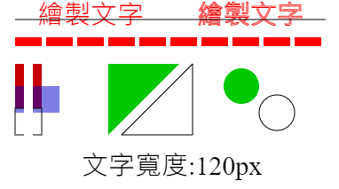

[回上層目錄](../README.md)

# 畫布(canvas)

## **敘述**
畫布可以繪製一些簡單的圖形或動畫，但在學習時發現很大多的教學都是針對傳統HTML的，所以做了一下再Vue.js下的使用範例減少踩坑。

## **教學&範例**
## 基礎線條和圖形
```vue
<template>
  <canvas id="canvas" class="canvas" ref="canvas" :width="width" :height="height">畫布</canvas>
</template>

<script>
export default {
  name: 'canvas-demo',
  methods: {
    ready () {
      // 畫布宣告
      this.initCanvas()
      // 繪圖
      this.drawing()
    },
    // 畫布宣告
    initCanvas () {
      // 定位目標DOM
      this.canvas = document.getElementById('canvas')
      // 渲染
      if (this.canvas.getContext) {
        this.context = this.canvas.getContext('2d')
      } else {
        console.log('瀏覽器不支援畫布(canvas)')
        alert('瀏覽器不支援畫布(canvas)')
      }
    },
    // 繪圖
    drawing () {
      this.setText()
      this.setLine()
      this.setRectangle()
      this.setTriangle()
      this.setRound()
    },
    setText () {
      const text = '繪製文字'
      // 文字顏色
      this.context.fillStyle = 'red'
      // 文字樣式
      this.context.font = '30px Arial bolder'
      // 指定文字在canvas中的水平位置(start,end,left,center,right)
      // this.context.textAlign = 'center'
      // 指定底線的對齊方式(top,hanging,middle,alphabetic,ideographic,bottom)
      // this.context.textBaseline = 'middle'
      // 繪製文字(內容,X, Y)
      this.context.fillText(text, 50, 30)
      // 邊框顏色
      this.context.strokeStyle = 'red'
      // 繪製文字邊框(內容,X, Y)
      this.context.strokeText(text, 230, 30)
      // 取得文字資訊
      const metrics = this.context.measureText(text)
      const tW = metrics.width
      this.context.fillStyle = '#000000'
      this.context.fillText('文字寬度:' + tW + 'px', 100, 150 + 50)
    },
    // 畫直線
    setLine () {
      // 邊框顏色
      this.context.strokeStyle = '#000000'
      // 開始一個新路徑
      this.context.beginPath()
      // 移動畫筆到(X,Y)
      this.context.moveTo(25, 25)
      // 從目前位置畫一直線到指定座標(X,Y)
      this.context.lineTo(this.width - 25, 25)
      // 畫出圖形邊框
      this.context.stroke()

      // 虛線([,])
      this.context.setLineDash([30, 5])
      // 邊框顏色
      this.context.strokeStyle = 'red'
      // 邊寬粗細
      this.context.lineWidth = 10
      // 開始一個新路徑
      this.context.beginPath()
      // 移動畫筆到(X,Y)
      this.context.moveTo(25, 50)
      // 從目前位置畫一直線到指定座標(X,Y)
      this.context.lineTo(this.width - 25, 50)
      // 畫出圖形邊框
      this.context.stroke()

      // 回覆實心
      this.context.setLineDash([0, 0])
      // 回覆黑色
      this.context.strokeStyle = '#000000'
      // 回復粗細
      this.context.lineWidth = 1
    },
    // 畫矩形
    setRectangle () {
      // 設定顏色(rgb(紅,綠,藍))
      this.context.fillStyle = 'rgb(200, 0, 0)'
      // 設定一個填滿顏色的矩形(原點出發X橫向位置,原點出發Y垂直位置,寬,高)
      this.context.fillRect(25, 75, 30, 50)
      // 設定顏色(rgb(紅,綠,藍,透明度))
      this.context.fillStyle = 'rgba(0, 0, 200, 0.5)'
      // 設定一個填滿顏色的矩形(原點出發X橫向位置,原點出發Y垂直位置,寬,高)
      this.context.fillRect(25, 100, 50, 30)
      // 設定一個邊框矩形
      this.context.strokeRect(25, 125, 30, 30)
      // 清除矩形內的內容
      this.context.clearRect(35, 70, 10, 100)
    },
    // 畫三角形
    setTriangle () {
      // 填色三角形
      this.context.fillStyle = 'rgb(0, 200, 0)'
      // 開始一個新路徑
      this.context.beginPath()
      // 移動畫筆到(X,Y)
      this.context.moveTo(130, 75)
      // 從目前位置畫一直線到指定座標(X,Y)
      this.context.lineTo(210, 75)
      // 從目前位置畫一直線到指定座標(X,Y)
      this.context.lineTo(130, 155)
      // 填滿路徑內容
      this.context.fill()

      // 邊框三角形
      // 開始一個新路徑
      this.context.beginPath()
      // 移動畫筆到(X,Y)
      this.context.moveTo(145, 155)
      // 從目前位置畫一直線到指定座標(X,Y)
      this.context.lineTo(225, 75)
      // 從目前位置畫一直線到指定座標(X,Y)
      this.context.lineTo(225, 155)
      // 結束一個路徑
      this.context.closePath()
      // 畫出圖形邊框
      this.context.stroke()
    },
    // 畫圓形
    setRound () {
      // 開始一個新路徑
      this.context.beginPath()
      // 產生一個弧形(圓心座標X,圓心座標Y,半徑,開始點,結束點,true逆向)
      this.context.arc(280, 100, 20, 0, Math.PI * 2, true)
      // 結束一個路徑
      this.context.closePath()
      // 填滿路徑內容
      this.context.fill()

      // 開始一個新路徑
      this.context.beginPath()
      // 產生一個弧形(圓心座標X,圓心座標Y,半徑,開始點,結束點,true逆向)
      this.context.arc(320, 130, 20, 0, Math.PI * 2, true)
      // 結束一個路徑
      this.context.closePath()
      // 畫出圖形邊框
      this.context.stroke()
    }
  },
  data () {
    return {
      // 畫布
      canvas: this.$refs.canvas,
      context: null,
      // 寬高
      width: 400,
      height: 400
    }
  },
  mounted () {
    this.ready()
  }
}
</script>
```


## **參考文章**
[參考文件](網址)

## **作者**
`Mr. Will`
