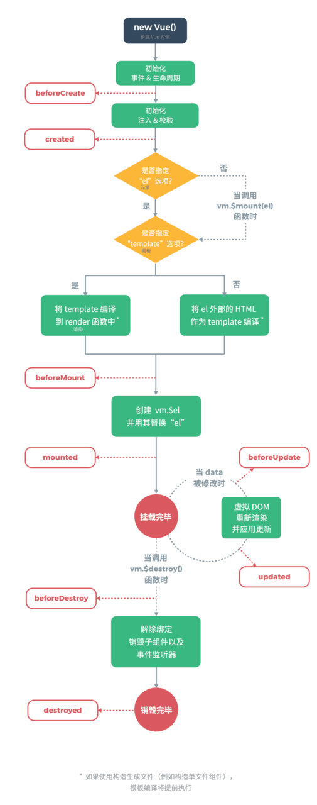

[回上層目錄](../README.md)

# 主題

## **Description [描述]**
Vue 3.x增加了新功能Composition API，這解決了Vue 2.x在Options API下不好維護的問題。

## **Teaching & Examples [教學&範例]**
### Composition API基礎樣式轉換對照
```vue
<template>
  <div class="demo">
    <div>Hello, {{ name }}!</div>
    <div v-for="city in citys">{{ city.name }}</div>
    <input v-model="name" />
    <button :disabled="!isNamePresent" @click="submitName">Submit</button>
  </div>
</template>

<script>
import HtmlNav from '@/components/html/Nav.vue'
// Options API
export default {
  // component
  components: { HtmlNav },
  data () {
    return {
      name: 'Will',
      citys: [
        { name: '台北', desc: '台灣首都' },
        { name: '高雄', desc: '光明之督' }
      ]
    }
  },
  watch: {
    name: function (newVal) {
      console.log(newVal)
    }
  },
  computed: {
    isNamePresent () {
      return this.name.length > 0
    }
  },
  methods: {
    submitName () {
      console.log(this.name)
    }
  }
}
</script>

<script>
import HtmlNav from '@/components/html/Nav.vue'
// Composition API
import { ref, reactive, watch, computed } from 'vue'
export default {
  // component，非包在setup裡面所以，還是舊方法
  components: { HtmlNav },
  setup () {
    // data
    const name = ref('Will')
    const citys = reactive([
      { name: '台北', desc: '台灣首都' },
      { name: '高雄', desc: '光明之督' }
    ])
    // watch
    watch(name, (newVal) => {
      console.log(newVal)
    })
    // computed
    const isNamePresent = computed(() => name.value.length > 0)
    // methods
    function submitName () {
      console.log(name.value)
    }
    return {
      name,
      citys,
      isNamePresent,
      submitName
    }
  }
}
</script>

<script setup>
// component，setup自己會引用
import HtmlNav from '@/components/html/Nav.vue'
// Composition API
import { ref, reactive, watch, computed } from 'vue'
// data
const name = ref('')
const citys = reactive([
  { name: '台北', desc: '台灣首都' },
  { name: '高雄', desc: '光明之督' }
])
// watch
watch(name, (newVal) => {
  console.log(newVal)
})
// computed
const isNamePresent = computed(() => name.value.length > 0)
// methods
function submitName () {
  console.log(name.value)
}
</script>
```

### 生命週期
| Options API | Hook inside(setup) | 說明 |
| :---- | :---- | :---- |
| beforeCreate | - - - | 例項初始化之後 |
| created | - - - | 例項建立完成後 |
| beforeMount | onBeforeMount | 掛載開始之前 |
| mounted | onMounted | 例項被掛載後 |
| beforeUpdate | onBeforeUpdate | 資料更新時 |
| updated | onUpdated | DOM重新渲染之後 |
| beforeUnmount<br/>beforeDestroy (X) | onBeforeUnmount | 例項銷燬之前 |
| unmounted<br/>destroyed (X) | onUnmounted | 例項銷燬後 |
| errorCaptured | onErrorCaptured | 捕獲一個來自子孫元件的錯誤時 |
| renderTracked | onRenderTracked |  |
| renderTriggered | onRenderTriggered |  |
| activated | onActivated | 快取的元件啟用時 |
| deactivated | onDeactivated | 快取的元件停用時 |



### 時間點
```vue
<template>
  <div class="demo">
    <div>Hello, {{ name }}!</div>
    <input v-model="name" />
    <button :disabled="!isNamePresent" @click="submitName">Submit</button>
  </div>
</template>

<script>
// Composition API
import { ref, watch, computed, onBeforeMount, onMounted, onBeforeUpdate, onUpdated } from 'vue'
export default {
  setup () {
    // data
    const name = ref('Will')
    // watch
    watch(name, (newVal) => {
      console.log(newVal)
    })
    // computed
    const isNamePresent = computed(() => name.value.length > 0)
    // methods
    function submitName () {
      console.log(name.value)
    }
    setTimeout(() => {
      console.log('1秒後執行')
    }, 1000)
    onBeforeMount(() => {
      console.log('DOM 渲染前')
    })
    onMounted(() => {
      console.log('DOM 渲染完成後')
    })
    onBeforeUpdate(() => {
      // 在資料更改導致virtual DOM重新渲染前調用
      console.log('資料更改前')
    })
    onUpdated(() => {
      // 在資料更改導致virtual DOM重新渲染後調用
      console.log('資料更改後')
    })
    return {
      name,
      isNamePresent,
      submitName
    }
  }
}
</script>
```

## **Reference article [參考文章]**
[參考文件](https://v3.cn.vuejs.org/)
[vue3 Composition API 學習手冊](https://ithelp.ithome.com.tw/articles/10236191)
[參考文件](https://www.thisdot.co/blog/vue-3-2-using-composition-api-with-script-setup)
[參考文件](https://www.tpisoftware.com/tpu/articleDetails/2530)
[參考文件](https://iter01.com/467302.html)

## **Author [作者]**
`Mr. Will`
